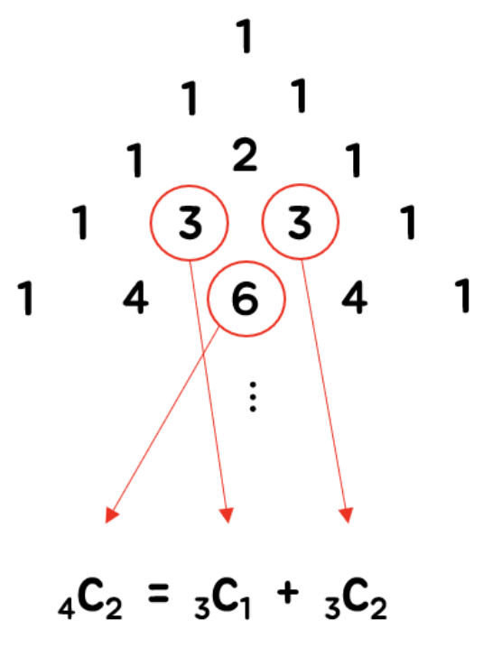

# 20230106 백준 알고리즘

## 이항 계수 1 (Level Bronze)
> https://www.acmicpc.net/problem/11050

### 문제
#### 문제 설명
자연수 N과 정수 K가 주어졌을 때 이항계수 (N/K)을 구하는 프로그램을 작성하시오.

#### 입력
첫째 줄에 N과 K가 주어진다. (1 ≤ N ≤ 10, 0 ≤ K ≤ N)

#### 출력
(K/N)을 출력한다.

#### 예제 입력 1
```
5
2
```

#### 예제 출력 1
```
10
```

### 참고 (이항계수)
조합론에서 이항 계수(二項係數, 영어: binomial coefficient)는 이항식을 이항 정리로 전개했을 때 각 항의 계수이며, 주어진 크기의 (순서 없는) 조합의 가짓수이다.



### 나의 답변
```python
import sys
input = sys.stdin.readline


def main():
    n, k = map(int, input().split())
    dp = list([1] * i for i in range(1, n+2))
    for i in range(n+1):
        for j in range(1, len(dp[i])-1):
            dp[i][j] = dp[i-1][j-1] + dp[i-1][j]

    print(dp[n][k])


main()
```