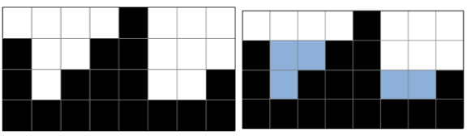

# 20221205 백준 알고리즘

## 빗물 (Level Gold)
> https://www.acmicpc.net/problem/14719

### 문제
#### 문제 설명
2차원 세계에 블록이 쌓여있다. 비가 오면 블록 사이에 빗물이 고인다.



비는 충분히 많이 온다. 고이는 빗물의 총량은 얼마일까?

#### 입력
첫 번째 줄에는 2차원 세계의 세로 길이 H과 2차원 세계의 가로 길이 W가 주어진다. (1 ≤ H, W ≤ 500)

두 번째 줄에는 블록이 쌓인 높이를 의미하는 0이상 H이하의 정수가 2차원 세계의 맨 왼쪽 위치부터 차례대로 W개 주어진다.

따라서 블록 내부의 빈 공간이 생길 수 없다. 또 2차원 세계의 바닥은 항상 막혀있다고 가정하여도 좋다.

#### 출력
2차원 세계에서는 한 칸의 용량은 1이다. 고이는 빗물의 총량을 출력하여라.

빗물이 전혀 고이지 않을 경우 0을 출력하여라.

#### 예제 입력 1
```
4 4
3 0 1 4
```

#### 예제 출력 1
```
5
```

#### 예제 입력 2
```
4 8
3 1 2 3 4 1 1 2
```

#### 예제 출력 2
```
5
```

#### 예제 입력 2
```
3 5
0 0 0 2 0
```

#### 예제 출력 2
```
0
```

### 나의 답변
```python
import sys
input = sys.stdin.readline

h, w = map(int, input().split())
lst = list(map(int, input().split()))


def solution(n, m, temp):
    board = list([0] * m for _ in range(n))
    index_board = list(list() for _ in range(n))
    for i in range(m):
        height = temp[i]
        for j in range(height):
            board[j][i] = 1
            index_board[j].append(i)

    result = 0
    for i in index_board:
        if len(i) >= 2:
            result += (i[-1]-i[0]) + 1 - len(i)
    return result

print(solution(h, w, lst))
```