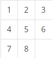
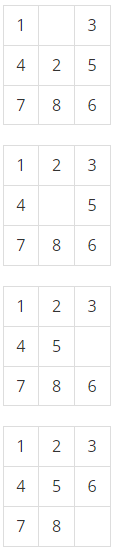

# 20221213 백준 알고리즘

## 퍼즐 (Level Gold)
> https://www.acmicpc.net/problem/1525'

### 문제
#### 문제 설명
3×3 표에 다음과 같이 수가 채워져 있다. 오른쪽 아래 가장 끝 칸은 비어 있는 칸이다.



어떤 수와 인접해 있는 네 개의 칸 중에 하나가 비어 있으면, 수를 그 칸으로 이동시킬 수가 있다. 물론 표 바깥으로 나가는 경우는 불가능하다. 우리의 목표는 초기 상태가 주어졌을 때, 최소의 이동으로 위와 같은 정리된 상태를 만드는 것이다. 다음의 예를 보자.



가장 윗 상태에서 세 번의 이동을 통해 정리된 상태를 만들 수 있다. 이와 같이 최소 이동 횟수를 구하는 프로그램을 작성하시오.

#### 입력
세 줄에 걸쳐서 표에 채워져 있는 아홉 개의 수가 주어진다. 한 줄에 세 개의 수가 주어지며, 빈 칸은 0으로 나타낸다.

#### 출력
첫째 줄에 최소의 이동 횟수를 출력한다. 이동이 불가능한 경우 -1을 출력한다.

#### 예제 입력 1
```
1 0 3
4 2 5
7 8 6
```

#### 예제 출력 1
```
3
```

#### 예제 입력 2
```
3 6 0
8 1 2
7 4 5
```

#### 예제 출력 2
```
-1
```

### 나의 답변
```python
import sys

input = sys.stdin.readline
from collections import deque

chart, board = "", dict()
for _ in range(3):
    chart += "".join(input().split())


def bfs(chart):
    q = deque()
    q.append(chart)
    board[chart] = 0
    d = [(-1, 0), (1, 0), (0, -1), (0, 1)]

    while q:
        now = q.popleft()
        if now == "123456780":
            return board[now]
        location = now.find("0")
        x, y = location % 3, location // 3

        for dx, dy in d:
            nx, ny = x + dx, y + dy
            n_location = ny * 3 + nx
            if 0 <= nx < 3 and 0 <= ny < 3:
                now_list = list(now)
                now_list[location], now_list[n_location] = now_list[n_location], now_list[location]
                nxt = ''.join(now_list)
                if nxt not in board.keys():
                    board[nxt] = board[now] + 1
                    q.append(nxt)
    return -1


print(bfs(chart))
```