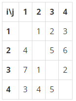

# 20221217 백준 알고리즘

## 스타트와 링크 (Level Silver)
> https://www.acmicpc.net/problem/14889

### 문제
#### 문제 설명
오늘은 스타트링크에 다니는 사람들이 모여서 축구를 해보려고 한다. 축구는 평일 오후에 하고 의무 참석도 아니다. 축구를 하기 위해 모인 사람은 총 N명이고 신기하게도 N은 짝수이다. 이제 N/2명으로 이루어진 스타트 팀과 링크 팀으로 사람들을 나눠야 한다.

BOJ를 운영하는 회사 답게 사람에게 번호를 1부터 N까지로 배정했고, 아래와 같은 능력치를 조사했다. 능력치 Sij는 i번 사람과 j번 사람이 같은 팀에 속했을 때, 팀에 더해지는 능력치이다. 팀의 능력치는 팀에 속한 모든 쌍의 능력치 Sij의 합이다. Sij는 Sji와 다를 수도 있으며, i번 사람과 j번 사람이 같은 팀에 속했을 때, 팀에 더해지는 능력치는 Sij와 Sji이다.

N=4이고, S가 아래와 같은 경우를 살펴보자.



예를 들어, 1, 2번이 스타트 팀, 3, 4번이 링크 팀에 속한 경우에 두 팀의 능력치는 아래와 같다.

- 스타트 팀: S12 + S21 = 1 + 4 = 5
- 링크 팀: S34 + S43 = 2 + 5 = 7
1, 3번이 스타트 팀, 2, 4번이 링크 팀에 속하면, 두 팀의 능력치는 아래와 같다.

- 스타트 팀: S13 + S31 = 2 + 7 = 9
- 링크 팀: S24 + S42 = 6 + 4 = 10

축구를 재미있게 하기 위해서 스타트 팀의 능력치와 링크 팀의 능력치의 차이를 최소로 하려고 한다. 위의 예제와 같은 경우에는 1, 4번이 스타트 팀, 2, 3번 팀이 링크 팀에 속하면 스타트 팀의 능력치는 6, 링크 팀의 능력치는 6이 되어서 차이가 0이 되고 이 값이 최소이다.

#### 입력
첫째 줄에 N(4 ≤ N ≤ 20, N은 짝수)이 주어진다. 둘째 줄부터 N개의 줄에 S가 주어진다. 각 줄은 N개의 수로 이루어져 있고, i번 줄의 j번째 수는 Sij 이다. Sii는 항상 0이고, 나머지 Sij는 1보다 크거나 같고, 100보다 작거나 같은 정수이다.

#### 출력
첫째 줄에 스타트 팀과 링크 팀의 능력치의 차이의 최솟값을 출력한다.

#### 예제 입력 1
```
4
0 1 2 3
4 0 5 6
7 1 0 2
3 4 5 0
```

#### 예제 출력 1
```
0
```

#### 예제 입력 2
```
6
0 1 2 3 4 5
1 0 2 3 4 5
1 2 0 3 4 5
1 2 3 0 4 5
1 2 3 4 0 5
1 2 3 4 5 0
```

#### 예제 출력 2
```
2
```

#### 예제 입력 3
```
8
0 5 4 5 4 5 4 5
4 0 5 1 2 3 4 5
9 8 0 1 2 3 1 2
9 9 9 0 9 9 9 9
1 1 1 1 0 1 1 1
8 7 6 5 4 0 3 2
9 1 9 1 9 1 0 9
6 5 4 3 2 1 9 0
```

#### 예제 출력 3
```
1
```

### 구현
- 순열, 조합
- 그래프

### 나의 답변
```python
import sys
from itertools import combinations, permutations
input = sys.stdin.readline


def solution():
    n = int(input())
    table = list(list(map(int, input().split())) for _ in range(n))
    population = n // 2
    total = list(i for i in range(1, n + 1))
    result = 10001
    for combination in combinations(total, population):
        total_set = set(total)
        team_a = set(combination)
        team_b = total_set - team_a

        team_a_score, team_b_score = 0, 0

        for permutation in permutations(list(team_a), 2):
            a, b = permutation
            team_a_score += table[a-1][b-1]

        for permutation in permutations(list(team_b), 2):
            a, b = permutation
            team_b_score += table[a-1][b-1]

        result = min(result, abs(team_a_score - team_b_score))

    return result


print(solution())
```