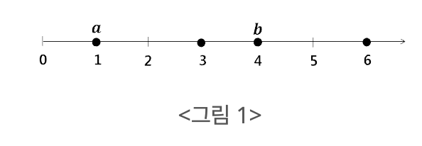
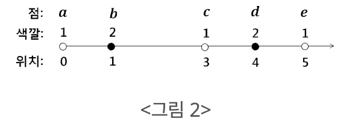
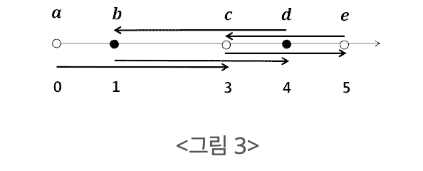

# 20230302 백준 알고리즘

## 화살표 그리기 (Level Silver)
> https://www.acmicpc.net/problem/15970

### 문제
#### 문제 설명
직선 위에 위치를 나타내는 0, 1, 2, ...와 같은 음수가 아닌 정수들이 일정한 간격으로 오른쪽 방향으로 놓여 있다. 이러한 위치들 중 N개의 위치에 하나씩 점들이 주어진다(<그림 1>). 주어진 점들의 위치는 모두 다르다. 두 점 사이의 거리는 두 점의 위치를 나타내는 수들의 차이이다. <그림 1>에서는 4개의 점이 주어지고 점 a와 b의 거리는 3이다.



각 점은 N개의 색깔 중 하나를 가진다. 편의상, 색깔은 1부터 N까지의 수로 표시한다.

각 점 p에 대해서, p에서 시작하는 직선 화살표를 이용해서 다른 점 q에 연결하려고 한다. 여기서, 점 q는 p와 같은 색깔의 점들 중 p와 거리가 가장 가까운 점이어야 한다. 만약 가장 가까운 점이 두 개 이상이면 아무거나 하나를 선택한다.

모든 점에 대해서 같은 색깔을 가진 다른 점이 항상 존재한다. 따라서 각 점 p에서 시작하여 위 조건을 만족하는 q로 가는 하나의 화살표를 항상 그릴 수 있다.

예를 들어, 점들을 순서쌍 (위치, 색깔) 로 표시할 때, a = (0,1), b = (1, 2), c = (3, 1), d = (4, 2), e = (5, 1)라고 하자. 

아래 <그림 2>에서 이 점들을 표시한다. 여기서 흰색은 1, 검은색은 2에 해당된다.



위의 조건으로 화살표를 그리면, 아래 <그림 3>과 같이 점 a의 화살표는 c로 연결된다. 점 b와 d의 화살표는 각각 d와 b로 연결된다. 또한 점 c와 e의 화살표는 각각 e와 c로 연결된다. 따라서 모든 화살표들의 길이 합은 3 + 3 + 2 + 3 + 2 = 13이다.



점들의 위치와 색깔이 주어질 때, 모든 점에서 시작하는 화살표들의 길이 합을 출력하는 프로그램을 작성하시오.

#### 입력
표준 입력으로 다음 정보가 주어진다. 첫 번째 줄에는 점들의 개수를 나타내는 정수 N이 주어 진다. 다음 N개의 줄 각각에는 점의 좌표와 색깔을 나타내는 두 정수 x와 y가 주어진다.

#### 출력
표준 출력으로 모든 점에서 시작하는 화살표들의 길이 합을 출력한다.

#### 제한
모든 서브태스크에서 점들의 위치 x와 색깔 y는 각각 0 ≤ x ≤ 10^5, 1 ≤ y ≤ N를 만족한다.

#### 서브태스크 1 (25점)
점들이 가진 각 색깔 c에 대해서, 색깔 c를 가진 점은 정확히 두 개 존재하고 점들의 개수는 2 ≤ N ≤ 10를 만족한다.

#### 서브태스크 2 (31점)
점들의 색깔은 모두 동일하고 점들의 개수는 2 ≤ N ≤ 300를 만족한다.

#### 서브태스크 3 (33점)
점들의 색깔은 정확히 두 가지이고 점들의 개수는 2 ≤ N ≤ 1,000를 만족한다.

#### 서브태스크 4 (11점)
점들의 개수는 2 ≤ N ≤ 5,000를 만족한다.

#### 예제 입력 1
```
5
0 1
1 2
3 1
4 2
5 1
```

#### 예제 출력 1
```
13
```

#### 예제 입력 2
```
7
6 1
7 2
9 1
10 2
0 1
3 1
4 1
```

#### 예제 출력 2
```
16
```

### 나의 답변
```python
import sys
input = sys.stdin.readline


def main():
    n = int(input())
    lst = list([] for _ in range(n + 1))
    points = list(list(map(int, input().split())) for _ in range(n))
    for point in points:
        loc, color = point
        lst[color].append(loc)

    res = 0
    for l in lst:
        l.sort()
        tmp = 0
        for i in range(len(l)):
            if i == 0:
                tmp += l[i+1] - l[i]
            elif i == len(l)-1:
                tmp += l[i] - l[i-1]
            else:
                tmp += min(l[i+1] - l[i], l[i] - l[i-1])

        res += tmp
    print(res)


main()

```