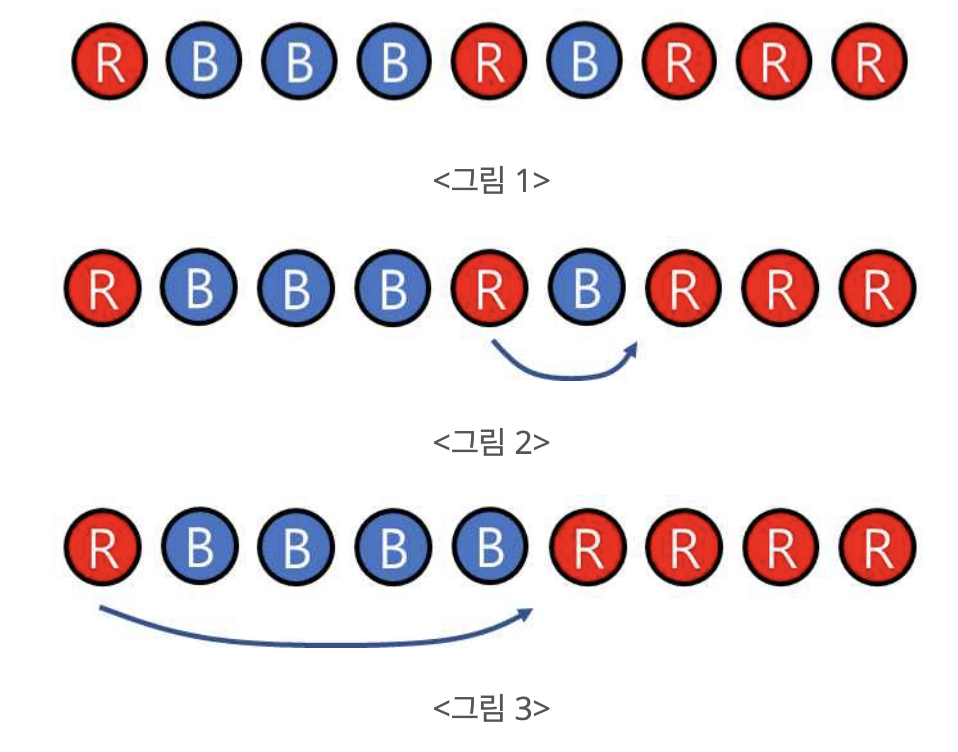
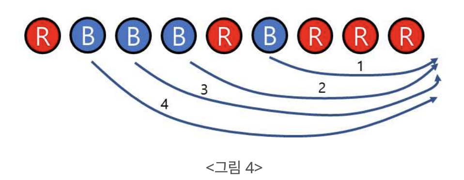

# 20230214 백준 알고리즘

## 볼 모으기 (Level Silver)
> https://www.acmicpc.net/problem/17615

### 문제
#### 문제 설명
빨간색 볼과 파란색 볼이 <그림 1>에서 보인 것처럼 일직선상에 섞여 놓여 있을 때, 볼을 옮겨서 같은 색 볼끼리 인접하게 놓이도록 하려고 한다. 볼을 옮기는 규칙은 다음과 같다.

바로 옆에 다른 색깔의 볼이 있으면 그 볼을 모두 뛰어 넘어 옮길 수 있다. 즉, 빨간색 볼은 옆에 있는 파란색 볼 무더기를 한 번에 뛰어 넘어 옮길 수 있다. 유사하게, 파란색 볼은 옆에 있는 빨간색 볼 무더기를 한 번에 뛰어 넘어 옮길 수 있다.
옮길 수 있는 볼의 색깔은 한 가지이다. 즉, 빨간색 볼을 처음에 옮겼으면 다음에도 빨간색 볼만 옮길 수 있다. 유사하게, 파란색 볼을 처음에 옮겼으면 다음에도 파란색 볼만 옮길 수 있다.
예를 들어, 처음에 볼이 <그림 1>에서 보인 것처럼 있을 때, 빨간 볼을 <그림 2>에서 보인 것처럼 옮긴 후, <그림 3>에서 보인 것처럼 옮긴다면 두 번 만에 같은 색끼리 모을 수 있다.



반면에 파란색 볼을 선택하여 에서 보인 것처럼 옮기면(화살표에 있는 수는 옮기는 순서를 나타낸다) 네 번을 옮겨야 같은 색의 볼끼리 모을 수 있다.



일직선상에 놓여 있는 볼에 관한 정보가 주어질 때, 규칙에 따라 볼을 이동하여 같은 색끼리 모으되 최소 이동횟수를 찾는 프로그램을 작성하시오.

#### 입력
첫 번째 줄에는 볼의 총 개수 N이 주어진다. (1 ≤ N ≤ 500,000) 다음 줄에는 볼의 색깔을 나타내는 문자 R(빨간색 볼) 또는 B(파란색 볼)가 공백 없이 주어진다. 문자열에는 R 또는 B 중 한 종류만 주어질 수도 있으며, 이 경우 답은 0이 된다.

#### 출력
최소 이동횟수를 출력한다.

#### 서브테스크

|번호|배점|제한|
|---|---|---|
|1|15|N ≤ 10|
|2|22|N ≤ 1,000|
|3|14|N ≤ 500,000, 처음 상태에서 모든 파란 공은 연속해서 존재한다.|
|4|40|원래의 제약조건 이외에 아무 제약조건이 없다.|

#### 예제 입력 1
```
9
RBBBRBRRR
```

#### 예제 출력 1
```
2
```

#### 예제 입력 2
```
8
BBRBBBBR
```

#### 예제 출력 2
```
1
```

### 나의 답변
```python
import sys
input = sys.stdin.readline


def main():
    n = int(input())
    ball = list(input().strip())

    if n == 1:
        return 0

    result_1 = 0
    # 왼쪽에 빨강색 공을 모으는 경우
    flag = False
    if ball[0] == 'R':
        flag = True
    for i in range(1, n):
        if ball[i] == 'R' and not flag:
            result_1 += 1
        elif ball[i] == 'B':
            flag = False

    # 왼쪽에 파란 공을 모으는 경우
    result_2 = 0
    flag = False
    if ball[0] == 'B':
        flag = True
    for i in range(1, n):
        if ball[i] == 'B' and not flag:
            result_2 += 1
        elif ball[i] == 'R':
            flag = False

    # 오른쪽에 빨강색 공을 모으는 경우
    ball = list(reversed(ball))
    result_3 = 0
    flag = False
    if ball[0] == 'R':
        flag = True
    for i in range(1, n):
        if ball[i] == 'R' and not flag:
            result_3 += 1
        elif ball[i] == 'B':
            flag = False

    # 오른쪽에 파란 공을 모으는 경우
    result_4 = 0
    flag = False
    if ball[0] == 'B':
        flag = True
    for i in range(1, n):
        if ball[i] == 'B' and not flag:
            result_4 += 1
        elif ball[i] == 'R':
            flag = False

    return min(result_1, result_2, result_3, result_4)


print(main())
```