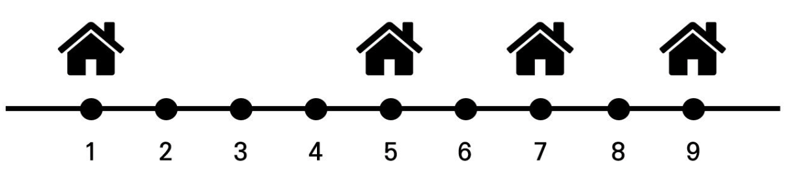

# 20230119 백준 알고리즘

## 안테나 (Level Silver)
> https://www.acmicpc.net/problem/18310

### 문제
#### 문제 설명
일직선 상의 마을에 여러 채의 집이 위치해 있다. 이중에서 특정 위치의 집에 특별히 한 개의 안테나를 설치하기로 결정했다. 효율성을 위해 안테나로부터 모든 집까지의 거리의 총 합이 최소가 되도록 설치하려고 한다. 이 때 안테나는 집이 위치한 곳에만 설치할 수 있고, 논리적으로 동일한 위치에 여러 개의 집이 존재하는 것이 가능하다.

집들의 위치 값이 주어질 때, 안테나를 설치할 위치를 선택하는 프로그램을 작성하시오.

예를 들어 N=4이고, 각 위치가 1, 5, 7, 9일 때를 가정하자.



이 경우 5의 위치에 설치했을 때, 안테나로부터 모든 집까지의 거리의 총 합이 (4+0+2+4)=10으로, 최소가 된다.

#### 입력
첫째 줄에 집의 수 N이 자연수로 주어진다. (1≤N≤200,000) 둘째 줄에 N채의 집에 위치가 공백을 기준으로 구분되어 1이상 100,000이하의 자연수로 주어진다.

#### 출력
첫째 줄에 안테나를 설치할 위치의 값을 출력한다. 단, 안테나를 설치할 수 있는 위치 값으로 여러 개의 값이 도출될 경우 가장 작은 값을 출력한다.

#### 예제 입력 1
```
4
5 1 7 9
```

#### 예제 출력 1
```
5
```

### 나의 답변 (시간 초과)
```python
import sys
input = sys.stdin.readline


def distance(lst, point):
    result = 0
    for i in lst:
        result += abs(i - point)
    return result


def main():
    n = int(input())
    houses = list(map(int, input().split()))
    houses.sort()
    answer = list()
    for i in range(n):
        temp = distance(houses, houses[i])
        answer.append((temp, i))
    answer.sort()
    print(houses[answer[0][1]])


main()
```

### 나의 답변 (시간 초과 해결)
- 간단하게 생각을 해보도록 하자 !

```python
import sys
input = sys.stdin.readline


def main():
    n = int(input())
    houses = list(map(int, input().split()))
    houses.sort()

    print(houses[(n-1) // 2])


main()
```