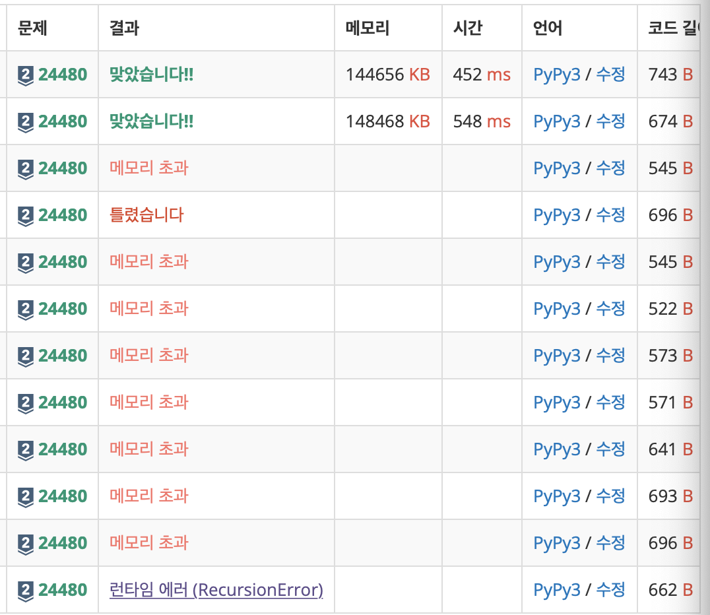

# 20230120 백준 알고리즘

## 알고리즘 수업 - 깊이 우선 탐색 2 (Level Silver)
> https://www.acmicpc.net/problem/24480

### 문제
#### 문제 설명
오늘도 서준이는 깊이 우선 탐색(DFS) 수업 조교를 하고 있다. 아빠가 수업한 내용을 학생들이 잘 이해했는지 문제를 통해서 확인해보자.

N개의 정점과 M개의 간선으로 구성된 무방향 그래프(undirected graph)가 주어진다. 정점 번호는 1번부터 N번이고 모든 간선의 가중치는 1이다. 정점 R에서 시작하여 깊이 우선 탐색으로 노드를 방문할 경우 노드의 방문 순서를 출력하자.

깊이 우선 탐색 의사 코드는 다음과 같다. 인접 정점은 내림차순으로 방문한다.

```
dfs(V, E, R) {  # V : 정점 집합, E : 간선 집합, R : 시작 정점
    visited[R] <- YES;  # 시작 정점 R을 방문 했다고 표시한다.
    for each x ∈ E(R)  # E(R) : 정점 R의 인접 정점 집합.(정점 번호를 내림차순으로 방문한다)
        if (visited[x] = NO) then dfs(V, E, x);
}
```

#### 입력
첫째 줄에 정점의 수 N (5 ≤ N ≤ 100,000), 간선의 수 M (1 ≤ M ≤ 200,000), 시작 정점 R (1 ≤ R ≤ N)이 주어진다.

다음 M개 줄에 간선 정보 u v가 주어지며 정점 u와 정점 v의 가중치 1인 양방향 간선을 나타낸다. (1 ≤ u < v ≤ N, u ≠ v) 모든 간선의 (u, v) 쌍의 값은 서로 다르다.

#### 출력
첫째 줄부터 N개의 줄에 정수를 한 개씩 출력한다. i번째 줄에는 정점 i의 방문 순서를 출력한다. 시작 정점의 방문 순서는 1이다. 시작 정점에서 방문할 수 없는 경우 0을 출력한다.

#### 예제 입력 1
```
5 5 1
1 4
1 2
2 3
2 4
3 4
```

#### 예제 출력 1
```
1
4
3
2
0
```

### 나의 답변 (메모리 초과)
```python
import sys
sys.setrecursionlimit(10 ** 8)
input = sys.stdin.readline


def dfs(v):
    global visited, count, graph
    visited[v] = count
    graph[v].sort(reverse=True)

    for i in graph[v]:
        print(visited, i)
        if visited[i] == 0:
            count += 1
            dfs(i)


n, m, r = map(int, input().split())
graph = list(list() for _ in range(n+1))
visited = [0] * (n+1)
count = 1

for _ in range(m):
    x, y = map(int, input().split())
    graph[x].append(y)
    graph[y].append(x)

dfs(r)

for p in visited[1:]:
    print(p)
```

### 나의 답변 (메모리 초과 해결)
```python
import sys
input = sys.stdin.readline


def main():
    n, m, r = map(int, input().split())
    graph = list(list() for _ in range(n+1))
    visited = [0] * (n+1)
    answer = [0] * (n+1)
    count = 1
    stack = list()

    for _ in range(m):
        x, y = map(int, input().split())
        graph[x].append(y)
        graph[y].append(x)

    for i in range(1, n+1):
        graph[i].sort()

    stack.append(r)

    while stack:
        cur_node = stack.pop()
        visited[cur_node] = 1
        if answer[cur_node] == 0:
            answer[cur_node] = count
            count += 1

        for next_node in graph[cur_node]:
            if visited[next_node] == 0:
                stack.append(next_node)

    print(* answer[1:])


main()
```

#### 헤프닝...ㅎ

