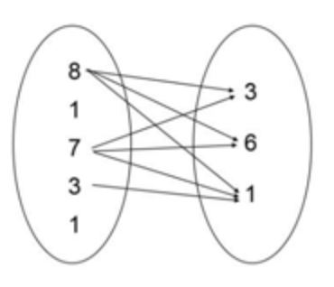

# 20230118 백준 알고리즘

## 먹을 것인가 먹힐 것인가 (Level Silver)
> https://www.acmicpc.net/problem/7795

### 문제
#### 문제 설명
심해에는 두 종류의 생명체 A와 B가 존재한다. A는 B를 먹는다. A는 자기보다 크기가 작은 먹이만 먹을 수 있다. 예를 들어, A의 크기가 {8, 1, 7, 3, 1}이고, B의 크기가 {3, 6, 1}인 경우에 A가 B를 먹을 수 있는 쌍의 개수는 7가지가 있다. 8-3, 8-6, 8-1, 7-3, 7-6, 7-1, 3-1.



두 생명체 A와 B의 크기가 주어졌을 때, A의 크기가 B보다 큰 쌍이 몇 개나 있는지 구하는 프로그램을 작성하시오.

#### 입력
첫째 줄에 테스트 케이스의 개수 T가 주어진다. 각 테스트 케이스의 첫째 줄에는 A의 수 N과 B의 수 M이 주어진다. 둘째 줄에는 A의 크기가 모두 주어지며, 셋째 줄에는 B의 크기가 모두 주어진다. 크기는 양의 정수이다. (1 ≤ N, M ≤ 20,000) 

#### 출력
각 테스트 케이스마다, A가 B보다 큰 쌍의 개수를 출력한다.

#### 예제 입력 1
```
2
5 3
8 1 7 3 1
3 6 1
3 4
2 13 7
103 11 290 215
```

#### 예제 출력 1
```
7
1
```

### 나의 답변
```python
import sys
input = sys.stdin.readline


def main():
    t = int(input())
    for _ in range(t):
        n, m = map(int, input().split())
        a = list(map(int, input().split()))
        b = list(map(int, input().split()))
        a.sort(reverse=True)
        b.sort()

        count = 0
        for num_a in a:
            for num_b in b:
                if num_a > num_b:
                    count += 1
                else:
                    break
        print(count)


main()
```