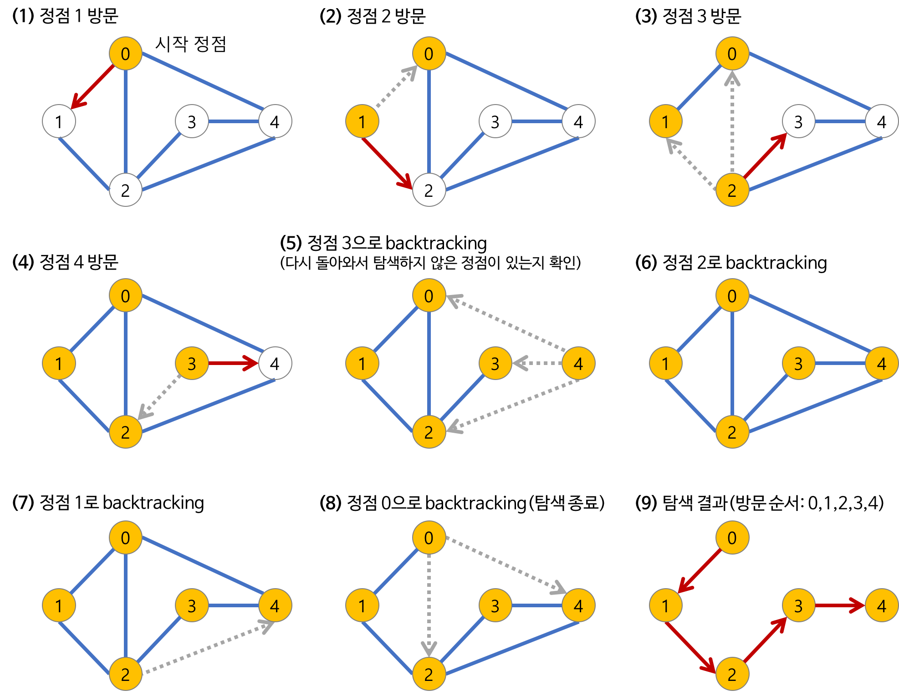

# 알고리즘
## 1. BruteForce (브루트포스)
### 정의
- brute: 무식, force: 힘, 즉 무식한 힘으로 해석할 수 있다.
- 완전탐색 알고리즘이다.
- 가능한 모든 경우의 수를 모두 탐색하면서 요구 조건에 충족되는 결과만을 가져온다.
- 이 알고리즘의 강력한 점은 에외 없이 100% 확률로 정답만을 출력한다.
- 알고리즘 설계의 가장 기본적인 방법: 해가 존재할 것으로 예상되는 모든 영역을 전체 탐색하는 방법이다.

### 문제해결 방법
1. 주어진 문제를 선형 구조로 구조화 한다.
2. 구조화된 문제 공간을 적절한 방법으로 해를 구성할 때까지 탐색한다.
3. 구성된 해를 정리한다.

## 2. Implementation(구현)
### 정의
- 알고리즘을 소스코드로 바꾸는 과정이다.
- 보통 구현문제는 풀이를 떠올리기는 쉽지만 소스코드로 옮기기 어려운 문제를 의미한다.

### 주의점
- 완전 탐색처럼 많은 경우의 수를 계산할 때, 주의해야할 점은 일반 코딩 테스트환경에서는 파이썬으로 제출한 코드가 1초에 2000만번의 연산을 수행하는 것이다.
- 대부분의 코딩테스트는 제한시간이 1초임을 기억해야한다.

## 3. Backtracking(백트래킹)
### 정의
- 모든 경우의 수를 전부 고려하는 알고리즘이다.
- 상태공간을 트리로 나타낼 수 있을 때, 사용하기 적합한 방식이다.
- 해를 찾아가는 도중, 지금의 경로가 해가 될 것 같지 않으면 그 경로를 더이상 가지 않고 되돌아가기때문에, 반복문의 횟수를 줄일 수 있기 때문에 효율적이다.
- 방식에 따라서 깊이우선탐색, 너비우선탐색, 최선우선탐색이 있다.

## 4. Depth First Search(깊이우선탐색)
- 가능한 모든 경로를 탐색한다. 따라서, 불필요할 것 같은 경로를 사전에 차단하거나 하는 등의 행동이 없으므로 경우의 수를 줄일 수 없다.
- 자기 자신을 호출하는 순환 알고리즘의 형태를 가지고 있다.
- 이 알고리즘을 구현할 때, 가장 큰 차이점은, 그래프 탐색의 경우 어떤 노드를 방문했었는지 여부를 반드시 검사를 해야한다는 것이다.
### DFS 과정


### DFS 구현
1. 순환 호출 이용
```python
def recursive_dfs(v, visited=[]):
    visited.append(v)
    for w in graph[v]:
        if not w in visited:
            visited = recursive_dfs(w, visited)
    return visited
}
```
2. 명시적인 스택 사용
```python
def iterative_dfs(start_v):
    visited = []
    stack = [start_v]
    while stack:
        v = stack.pop()
        if v not in visited:
            visited.append(v)
            for w in graph[v]:
                stack.append(w)

return visited
```

### DFS 공간 및 시간 복잡도
- 공간복잡도
  - 그래프 내 정점의 개수 n, 간선의 개수 m이라고할 때
  - 인접 행렬로 그래프를 구현할 경우: O(n^2)
  - 인접 리스트로 그래프를 구현할 경우: O(n + m)
- 시간복잡도
  - 인접 행렬로 구현되는 경우 하나의 정점 당 n번 check를 해주어야 하기 때문에 O(n^2)이다.
  - 인접 리스트의 경우에는 정점 방문과 인접 정점 방문이므로 O(n + m)의 시간복잡도를 지닌다.

## 5. Breadth First Search(너비 우선 탐색)
- 모든 분기점을 검사하면서 진행하는 방식으로 Queue를 이용하여 구현한다.
- 두 노드 사이의 최단경로 혹은 임의의 경로를 찾고 싶을 때, 사용한다.
- 방문한 노드들을 차례로 저장한 후 꺼낼 수 있는 자료 구조인 Queue를 사용한다.

### BFS 과정


### BFS 구현
- 자료 구조 Queue를 이용
```python
def bfs(start_v):
    visited = [start_v]
    Q = deque([start_v])
    while Q:
        v = Q.popleft()
        for w in graph[v]:
            if w not in visited:
                visited.append(w)
                Q.append(w)

    return visited
```

### BFS 공간 및 시간 복잡도
- 효율성은 DFS와 동일하다.
- 그래프 내 정점의 개수를 n, 간선의 개수를 m이라 할때
- 인접 행렬로 그래프를 구현할 경우: O(n^2)
- 인접 리스트로 그래프를 구현할 경우: O(n + m)

## 6. 우선순위 큐

## 7. 투 포인터 & 슬라이싱 윈도우

## 8. 다이나믹 프로그래밍

## 9. 다익스트라

## 10. 벨만포드

## 11. 누적합

## 12. 비트마스킹

## 13. 유니온파인드

## 14. 이분탐색