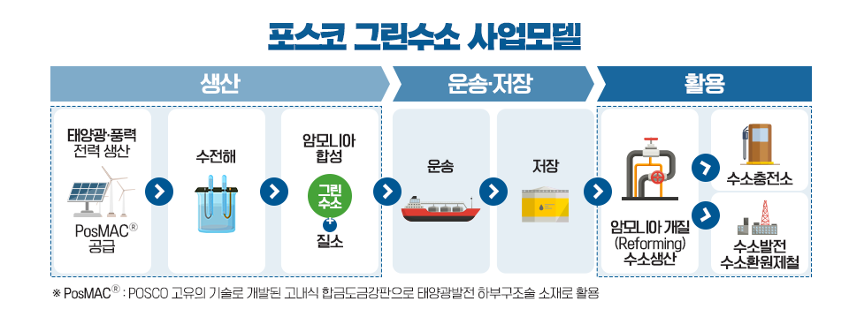

# POSCO

## 비전

### 포스코 경영이념

 더보기 

- 포스코는 '더불어 함께 발전하는 **기업시민**'을 추구합니다. 포스코 스스로가 사회 구성원의 일원이 되어 임직원, 주주, 고객, 공급사, 협력사, 지역사회 등 여러 이해관계자와 더불어 함께 발전하고, 배려와 공존, 공생의 가치를 함께 추구해 나가고자 합니다.

### 경영비전

 더보기 

- 더불어 함께 발전하는 기업시민 의미를 담고 있는 With의 의미를 시각적으로 전달하기 위해 W는 두 사람이 손을 맞잡고있는 모습을 이미지화해 공감적 어울림이 꾸준히 지속됨을 표현하였습니다. 따뜻한 오렌지색은 함께 발전하는 긍정 에너지를 담았습니다.

### 활동 영역

 더보기 

- 비지니스 파트너와 함께 Win-Win할 수 있는 공생가치를 창출하여 강건한 산업생태계를 조성하고, 사회공동체의 일원으로 경제적 이윤 창출을 넘어 사회문제 해결에 적극적으로 동참하며, 신뢰와 창의의 조직문화로 임직원이 보람과 행복을 느끼는 회사를 만들어갑니다.

### 인재상

 더보기 

- 기업시민 포스코의 구성원인 임직원은 **실천**의식을 바탕으로 협업하여 시너지를 창출하고, 겸손과 존중의 마인드로 **배려**할 줄 알며, 유연한 사고와 지속적 학습으로 도전적 아이디어를 제시하는 **창의**적 인재를 지향합니다.

### 행동강령

 더보기 

- 실질을 우선하고 실행을 중시하며 실리를 추구해 나가는 가치를 실천해 나갑니다. 형식보다는 실질을 우선하고 보고보다는 실행을 중시하고, 명분보다는 실리를 추구함으로써 가치경영, 상생경영, 혁신경영을 실현해 나갑니다.

### 핵심가치

 더보기 

- 포스코의 핵심가치는 **안전, 상생, 윤리, 창의**입니다.
- '안전'은 인간존중을 우선으로 직책보임자부터 솔선수범하여 실천우선의 안전행동을 체질화하는 것입니다. '상생'은 배려와 나눔을 실천하고 공생발전을 추구하며, 사회적 가치창출을 통하여 함께 지속성장하는 것입니다. '윤리'는 사회 구성원 간 상호신뢰를 기반하여 정도를 추구하고 신상필벌의 원칙을 지키는 것입니다. '창의'는 열린사고로 개방적인 협력을 통하여 문제를 주도적으로 해결하는 것입니다.

### 포스코 경영이념 체계도

 더보기 

### 포스코 기업시민헌장

 더보기 

- **더불어 함께 발전하는 기업시민** 경영이념 실현을 위한 지향점과 실천원칙

## 역사

 더보기 

- [1967~1970 포스코 창업기](https://www.posco.co.kr/homepage/docs/kor6/jsp/company/posco/s91a1000012c.jsp)
- [1971~1981 포항건설기](https://www.posco.co.kr/homepage/docs/kor6/jsp/company/posco/s91a1000013c.jsp)
- [1982~1992 광양건설기](https://www.posco.co.kr/homepage/docs/kor6/jsp/company/posco/s91a1000014c.jsp)
- [1993~2002 민영화](https://www.posco.co.kr/homepage/docs/kor6/jsp/company/posco/s91a1000015c.jsp)
- [2003~현재 글로벌화](https://www.posco.co.kr/homepage/docs/kor6/jsp/company/posco/s91a1000018c.jsp)

## 포스코그룹 성장 비전 및 7대 핵심사업 성장전략
### 배경

 더보기 

- 전 세계에 걸쳐 모든 산업분야에서의 저탄소 전환은 글로벌 비즈니스 패러다임을 바꾸고 있으며, 4차 산업형명으로 촉발된 기술 혁신은 기업 경영의 근본적인 변화를 요구하고 있는 상황이다.
- 포스코 그룹은 이러한 초 불확실성 시대의 사업환경에서 생존하고, 100년 기업으로 도약하기 위한 초석을 놓기 위해 지주회사체제 전환을 결정했다. 지주회사인 포스코 홀딩스를 통해 기존 사업의 경쟁력을 끊임없이 강화하고, 미래 신사업을 지속적으로 발굴 및 육성함으로써 변화와 적응을 가능케 하는 경영체제를 구축하는 것이다.
- 포스코 그룹은 지주사를 중심으로 저탄소, 친환경 시대에 부응하여 미래 신사업 투자를 확대하고, 그룹 차원의 시너지 기회를 적극 발굴하며, 기술혁신을 가속화하는 한편, ESG 경영을 강화함으로써 2030년 기업가치를 현재의 3배 이상 증가시킨다는 목표를 가지고 있다.

### 1. 포스코 성장 비전

 더보기 

- 포스코 그룹은 미래 사회의 지속가능성에 기여할 수 있는 **철강, 이차전지소재, 리튬 및 니켈, 수소, 에너지, 건축 인프라, 식량** 등 7대 핵심사업을 기반으로 성장을 추진한다는 방침이다.
- "인류의 지속가능한 미래를 선도하는 글로벌 비즈니스 리더"를 성장비전으로 삼고, 철강 탄소중립 완성, 모빌리티 견인, 그린에너지 선도, 미래 주거 실현, 글로벌 식량자원 확보의 5가지 지향점을 실현하기 위해 7대 핵심사업의 경쟁력을 강화해 나갈 예정이다.

### 2. 7대 핵심사업 성장전략

 더보기 

### 철강
현재 철강산업은 환경이 최우선 가치로 부각되어 각 국가와 기업들이 탄소중립 계획을 발표하고 온실가스감축목표(NDC)를 강화하고 있으며, 환경규제와 맞물린 무역 장벽 역시 높아지고 있다. 더불어 ‘Green Steel’로 불리는 친환경 고급강 수요는 증가하는 반면, 환경 부담에 따른 철강설비 증설은 자제되면서 수급 환경의 대변화도 예상된다.

이에 따라 철강 사업은 친환경 생산체제 기반 구축, 프리미엄 제품 판매 강화, 해외 투자 확대 등을 통해 글로벌 경쟁력을 더욱 공고히 한다는 방침이다.

포스코는 이러한 철강산업을 둘러싼 변화에 대응하기 위해 국내에서는 2030년까지 사회적 감축 10%를 포함해 CO2 배출량 총 20% 절감을 목표로 2조 원을 투자하여 탄소중립 생산체제 구축에 나선다.

탄소중립의 첨병인 수소환원제철은 2030년까지 국책과제를 통해 포스코 고유의 수소환원제철 모델 HyREX(하이렉스)의 데모 플랜트를 구축하고 상용화 가능성을 검증할 예정이다.

동시에 석탄 사용 저감 기술과 신규 전기로 도입 등을 통해 저탄소 제품 요구에 대응하고, 친환경 브랜드 포트폴리오 확대를 통한 수익성 개선에 주력하여 향후 2022년부터 2030년까지 평균 13%의 영업이익률 달성을 목표로 사업을 전개한다는 방침이다.

해외에서는 2030년까지 12조 원을 투자하여 현재 510만 톤의 조강 능력을 2,310만 톤으로 확대하고, 영업이익률은 7% 수준으로 끌어올린다는 목표다. 이를 위해 Green Steel 생산 등 친환경 경쟁력을 보유한 지역을 중심으로 원료 및 에너지 파트너사와의 협력 체제를 구축해 글로벌 생산 능력을 확보할 계획이다.

인도의 경우 향후 그린수소 생산 경쟁력이 높을 것이라는 판단에 따라 수소 활용까지 고려한 진출 전략을 수립했으며, 철강산업 성장 잠재력을 보유한 동남아 시장의 수요에 대비해 인도네시아 일관밀 확장을 계획 중이다. 풍부한 철 스크랩 등 친환경 철원류를 보유하고 있는 미국 또한 Green Steel을 주도하는 신성장 시장으로 부상하고 있어, 향후 미국에서의 전기로 일관밀 합작도 고려하고 있다.

### 이차전지소재(음/양극제) 사업
이차전지소재 사업은 양•음극재 생산능력을 현재 약 11만 5천 톤에서 2030년 68만 톤까지 확대하고, 선도 기술 확보를 통해 글로벌 Top-Tier로 도약한다는 목표다.

먼저 양극재는 국내와 중국에서 배터리사를 공략한 생산기지 집적화를 추진하고, 미국에서는 GM과의 합작을 통해 대규모 공장을 설립하는 등 생산능력을 2030년 42만 톤까지 확장하며 글로벌 입지를 다진다. 더불어 다양한 수요처 확보를 위해 프리미엄부터 저가형 제품까지 포트폴리오를 다변화하고, 차세대 배터리 소재 시장을 선점할 수 있도록 전고체전지용 소재도 개발해 나간다는 계획이다.

음극재는 흑연계에서 글로벌 리딩 경쟁력을 유지하고 실리콘계 사업에 진출하여, 2030년 26만 톤의 생산체제를 구축할 방침이다. 특히 중국 수입 의존도가 높은 흑연의 경우 천연흑연 공급처를 탄자니아, 호주 등 중국 외 지역으로 다변화하고, 인조흑연 역시 이번 달 1단계 준공을 마친 국내 유일의 생산 공장을 기반으로 자체 수급 능력을 갖춰 경쟁력을 높인다.

또한 차기 전기차에 사용될 실리콘계 음극재는 2023년 양산 설비 구축을 목표로 유럽 완성차 업체와 제품 개발에 협력 중이다.

### 리튬/니켈 사업
이차전지소재의 원료인 리튬과 니켈 사업은 자체 보유한 광산•염호와 친환경 생산기술을 통해 2030년까지 리튬 22만 톤, 니켈 14만 톤의 생산 능력을 갖춘 글로벌 Top 제조사로 거듭난다는 목표다.

리튬은 포스코그룹이 지난 2018년 선제적으로 확보한 아르헨티나 염호와 호주 필바라社의 광산 지분을 통해 경쟁력 높은 공급체계 구축을 지속한다. 지난 10여 년에 걸친 연구개발 끝에 친환경 리튬 추출 기술을 확보했으며, 전고체 전지용 황화리튬과 리튬메탈 등의 고부가가치 제품도 개발 중이다.

니켈은 2030년까지 광석 기반 11만 톤, 리사이클링 추출 3만 톤으로 총 생산능력 14만 톤을 확보할 방침이다. 호주와 인도네시아 등의 글로벌 니켈사와 합작하여 생산능력을 확충하는 한편, 급증하는 전기차 배터리 수요에 적기 대응할 수 있도록 기존 스테인리스스틸용 니켈 일부를 배터리용 고순도 니켈로 전환하는 투자를 진행 중이다.

또한 폐배터리 리사이클링 사업을 위해 내년 11월 광양에 1단계 리사이클링 공장을 준공 예정이며, 글로벌 폐배터리 수거 네트워크 보유사와 전략적 협력을 통해 배터리 순환 경제 완성에도 기여코자 한다.

### 수소 사업
수소 사업은 2030년까지 10조 원을 투자하여 연간 매출 2조 3천억 원, 생산 50만 톤 달성을 목표로 한다. 이후 20년간 사업을 고도화하여 2050년까지 연간 700만 톤의 수소 생산 체제를 구축해, 글로벌 Top 10 수소 공급 기업으로 자리 잡는다는 포부다.

포스코그룹은 자체 수소환원제철과 그룹사 포스코에너지의 발전 사업으로도 국내 최대 규모의 수소 수요가 발생하는 기업이다. 이러한 안정적인 내부 수요를 기반으로 적극적 외부 판매까지 연계하는 수소 사업 모델을 구축한다는 방침이다.

우선 초기 단계에서는 제철소에서 발생하는 부생가스를 활용해 수소 시장에 진출한다. 포스코그룹은 2026년까지 연간 7만 톤의 부생수소(그레이수소)를 연료전지 및 모빌리티용으로 공급하는 체제를 갖출 계획이다.

2030년까지는 해외에서 추진 중인 블루•그린수소 생산 프로젝트를 본격화하여 연간 50만 톤으로 생산량을 증대한다. 이후 2040년 300만 톤, 2050년 700만 톤으로 생산 능력을 단계적으로 확대해 국내외 철강, 연료전지, 발전, 충전소 등 대규모 B2B 수요처에 수소를 공급한다는 계획이다.

이를 위해 현재 포스코그룹은 7대 전략국가에서 19건의 수소 생산 프로젝트를 추진하며 공급망과 기술력을 확보하고 있다. 중동에서는 글로벌 최대 석유기업과 프로젝트 지분투자를 통한 블루수소 할당 구매권리(Off-take) 확보를 추진 중이며, 재생에너지 생산 여건이 우수한 호주와 오만 등에서는 철강을 연계한 다수의 그린수소 생산 프로젝트 참여를 검토하고 있다.

또한 수소 생산과 활용을 위한 핵심 기술 확보에도 나서고 있다. 대표적으로 한국과학기술원과 암모니아에서 수소를 추출하는 암모니아 크래킹 기술 연구 개발에 착수했으며, 한국원자력연구원과는 원전 연계 고온 수전해 기술 연구를, 두산중공업과는 암모니아 혼소터빈 발전기술 개발을 공동으로 추진 중이다.

### 에너지 사업
에너지 분야에서는 LNG, 암모니아, 신재생에너지 등 수소경제와 연계한 사업을 확대한다.

우선 신재생에너지로의 전환을 위한 가교로 주목받는 LNG의 비즈니스 확장을 위해 광양에 LNG 터미널 2단계 증설 사업을 진행 중이며, 당진 등에도 증설을 검토하고 있다.

LNG를 생산하는 E&P 사업은 미얀마 가스전 추가 개발을 지속하고 인도네시아, 말레이시아 등 동남아에서의 탐사 자산 개발도 진행할 계획이다.

발전 사업은 장기적으로 LNG 발전을 청정 수소 발전으로 전환한다는 목표로, 먼저 LNG 발전에 암모니아 혼소기술을 적용한 저탄소 발전을 추진한다. LNG 발전 외 풍력, 태양광 등 신재생 에너지 사업도 해외 선진기업과의 합작 등으로 확대해 나가면서, 그룹의 에너지 분야 발전용량을 2030년까지 현재의 약 2.5배인 8.3GW 수준으로 확대할 계획이다.

### 건축/인프라 사업
건축•인프라 분야는 2030년 친환경 수주액 4조 3천억 원 달성을 목표로 제로에너지빌딩, 모듈러 건축 등 친환경 분야의 수주를 확대하는 한편, 수소생산 플랜트 및 그린뉴딜 연계 해상풍력 플랜트 사업도 확장하여 친환경 인프라 기반의 지속 성장을 도모할 계획이다.

### 식량 사업
식량 사업(Agri-Bio)은 2030년 매출 10조 원을 목표로 북남미 등 해외에서 밸류체인을 구축하고 사업 교두보 마련에 나선다. 또한 국제 환경인증을 기반으로 환경이슈가 야기되지 않은 팜 농장 인수 혹은 팜유 정제사업 진출을 추진하면서, 글로벌 식량 메이저로서 취급량을 지속적으로 늘려 나간다는 방침이다.

이외에도 포스코그룹은 지주회사 체제 아래, 벤처투자를 그룹의 신사업 발굴 채널로 지속 활용함과 동시에 유망 벤처기업을 글로벌 유니콘기업(기업가치 1조 원 이상의 비상장기업)으로 육성함으로써 그룹의 미래 가치를 제고할 방침이다. 이를 위해 2030년까지 누계 8천억 원의 펀드 출자를 계획하고 있으며, 포스코의 출자액과 외부 벤처펀드 자금을 합한 펀드 결성 총액은 4조 원 이상이 될 것으로 전망된다.

벤처펀드는 이차전지소재, 수소 등 그룹 성장 사업 연관 분야 투자와 그래핀, 바이오 등 미래 유망 신수종 분야 투자로 나누어 진행되며, 벤처투자를 포스코그룹의 사업 역량 강화는 물론 그룹의 Seed 사업 발굴에도 활용할 방침이다.

## 수소 사업모델

 더보기 

- 포스코 그룹은 미래 청정에너지인 수소사업을 개척하고, 탈탄소시대를 선도하겠다는 의미를 담은 "수소경제를 견인하는 그린수소 선도기업"이라는 수소사업 비전을 밝혔다.
- 2030년까지 50만톤, 2050년까지 700만톤 생산체제를 구축하여 "Global Top Tier Hydrogen Provider"가 되는 것을 목표로 한다.

포스코그룹은 포스코의 수소환원제철과 포스코에너지의 발전 사업 자체만으로도 대한민국 최대 규모의 수소 수요가 발생하는 기업이다. 2050년 수소 생산 700만 톤 중 포스코그룹의 내부 수요는 500만 톤에 이를 것으로 예상되며, 이중 수소환원제철용은 370만 톤, 수소발전용은 130만 톤으로 전망된다. 이에, 포스코그룹은 ▲수소환원제철용 수소를 안정적으로 확보하고, ▲친환경 수소 발전 연료로의 전환을 선도하며, ▲국내·외 산업용 수소 수요를 개발/대응하는 것으로 수소사업의 전략 방향을 설정했으며, 안정적인 내부 수요를 바탕으로 경제적인 수소 생산 및 운송 체제를 구축해 외부 판매까지 연결하는 수소사업 모델을 구축하고 있다.

### 포스코그룹 그린수소 사업모델
포스코그룹은 수소의 생산부터 운송·저장, 활용에 이르기까지 각 분야에서 추진 중인 그룹사의 수소사업의 역량을 총망라해 ‘그린수소 사업모델’을 위한 밸류 체인을 구축함으로써, 대한민국 최대 수소 수요처이자 공급처로 발돋움할 계획이다.

그린수소 밸류체인을 완성하기 위한 포스코의 ‘그린수소 사업모델’에는 수소의 생산부터 운송, 저장 등 인프라 구축과 이를 어떻게 활용할지에 대한 모든 솔루션이 담겨있다.

[생산] 먼저, 그린수소는 재생에너지 환경이 우수한 지역에서 태양광·풍력 등 재생에너지를 기반으로 한 수전해 방식(전기분해)으로 생산한다. 수소 생산 거점을 구축하기 위해, 포스코홀딩스는 재생에너지 여건이 우수한 전략 국가를 선정하여 그린수소 프로젝트를 개발·투자한다. 또한 포스코는 재생에너지용 강재 공급을, 포스코인터내셔널은 CCS사업과 글로벌 수소 무역을, 포스코건설은 수전해 설비를 포함한 수소 생산 플랜트 EPC(시공·설계·조달)를 담당한다.

[운송·저장] 해외에서 생산된 수소는 효율적인 이송을 위해 암모니아로 합성한 후, 선박으로 운송하여 수소 터미널에 저장한다. 수소는 기체상태에서 폭발의 위험성이 있고, 액화하려면 -253˚C 로 냉각해야 하기 때문에, 일반적으로 장거리 운송을 위해서는 수소와 질소가 결합된 암모니아 상태로 운송하는 것이 안전하고 효율적이다. 이러한 운송·저장 과정에서 포스코는 수소 저장탱크와 파이프용 강재 생산을, 포스코에너지는 수소 터미널을 구축을, 포스코건설은 수소플랜트 EPC를 전문화한다는 방침이다.

[활용] 터미널에 저장한 암모니아는 개질 후 다시 수소로 추출하여, 수소환원제철, 발전, 수소차 등 다양한 수요처에 활용한다. 포스코그룹은 2030년까지 국내외에서 추진 중인 수소 생산 프로젝트를 통해 연간 50만 톤을 생산하여, 철강분야 25만 톤, 발전분야 33만 톤, 탈탄소 산업용 7만 톤을 공급할 계획이다. 특히, 철강분야 수소 수요는 수소환원제철로의 전환이 본격화되는 2030년대 중반 이후 크게 늘어날 것으로 전망됨에 따라, 2040년 300만 톤, 2050년 700만 톤으로 생산능력을 단계적으로 확대하여, 국내외 철강, 발전, 산업용 등 대규모 B2B 수요처에 수소를 공급할 계획이다.

### 수소환원제철 HyREX
철강은 1톤당 CO2 배출량이 약 1.8톤으로, 알루미늄, 플라스틱 등 다른 소재에 비해 생산과정에서 이산화탄소 발생량이 훨씬 적고, 생산된 철강재의 약 85% 이상이 재활용되는 친환경 소재이다. 그러나 거대한 생산 규모로 인해 연간 전 세계 CO2 발생량의 약 8%가 철강산업에서 배출되고 있다.

‘20년 12월 포스코는 탄소배출 감축 목표로 2030년 사업장 감축 △10% 및 사회적 감축 △10%, 2040년 △50%, 2050년 탄소중립을 달성하는 <2050 탄소중립>을 선언한 바 있다.

포스코는 ‘2050 탄소중립’을 실현하기 위해, 석탄과 철광석을 반응시켜 탄소를 배출하던 전통적인 고로 공정 제철 방식을 벗어나, FINEX(파이넥스) 공정 유동환원로 기술을 바탕으로 한 HyREX(하이렉스) 수소환원제철 기술을 개발 중이다. HyREX에서 수소는 예열을 거쳐 다단으로 구성된 유동환원로 하부로, 그리고 광석은 상부로 투입되어 고체환원철(DRI)이 만들어진다. 이후, 그린 전력을 이용하여 전기로 내에서 DRI를 녹이면 CO2 배출이 없이 쇳물을 생산할 수 있다.

포스코의 수소환원제철 HyREX는 철광석 분광을 가공없이 산지 그대로 직접 사용하는 유동환원로 방식을 채택함으로써, 사전 가공된 펠렛(Pellet)을 사용하는 샤프트환원로 기반 수소환원제철 보다 원료 확보가 용이하고 생산 원가가 경제적이다. 또한 HyREX 유동환원로는 여러 개의 반응기로 구성되어 있어, 단일 반응기로 된 샤프트환원로 보다 온도제어에 유리하다는 설비기술적인 이점이 있다.

### 친환경 철강 제품 브랜드
포스코는 고객사들의 탄소중립 실현과 저탄소 사회에 대비한 산업별 친환경 철강 제품 3대 전략 브랜드 ‘INNOVILT(이노빌트), e Autopos(이오토포스), Greenable(그린어블)’을 론칭했다.

- [INNOVILT] 포스코가 만든 국내 최초의 친환경 강건재 프리미엄 통합 브랜드인 ‘INNOVILT’는 혁신을 뜻하는 ‘Innovation’, 가치의 ‘Value’, 건설의 ‘Built’를 결합한 합성어로 친환경성과 독창성을 담은 미래기술 혁신을 통해 미래 건설시장을 선도해 나가겠다는 의지를 담고 있다. 2019년 11월 출범이래 129개사 213개 제품을 인증받아 다양한 곳에서 사용되고 있다.
- [e Autopos] 프리미엄 강건재 브랜드 ‘INNOVILT’에 이은 포스코의 두번째 제품·솔루션 통합브랜드인 ‘e Autopos’는 2021년 1월 론칭했다. 친환경의 ‘eco-friendly’, 전동화 솔루션의 ‘electrified AUTOmotive Solution of POSco’을 결합한 합성어로, 친환경성, 협업 시너지, 미래 지향을 담은 혁신을 통해 친환경차 시장을 선도하겠다는 의미를 담았다. 전기차와 수소차 등 친환경차에 사용되는 포스코의 철강 및 이차전지소재와 이를 활용하는 고객 맞춤형 솔루션을 제공한다. 대표적인 e Autopos 제품으로는 기가스틸(Giga Steel), 하이퍼 엔오(Hyper NO), Poss470FC가 있다.
  - ‘기가스틸’은 알루미늄 등 경쟁소재 대비 가격경쟁력이 우수하며, 환경친화적이다. 알루미늄과 비교해 소재가격은 1/3, 가공비는 절반 수준으로 낮출 수 있어 생산 비용을 효과적으로 절감할 수 있다. 포스코는 기가스틸을 활용한 전기차용 차체·샤시·배터리팩용 고장력 강판을 개발했다.
  - ‘Hyper NO’는 친환경자동차 구동모터용 고효율 전기강판이다. 전기강판은 두께가 얇을수록 에너지 효율이 높아지며, 전기에너지를 기계 에너지로 변화시키는 과정에서 필연적으로 발생하는 에너지 손실을 최소화할 수 있다. ‘Hyper NO’는 0.15mm 두께까지 초극박 생산이 가능하며, 기존 전기강판 대비 에너지 손실이 30% 이상 낮다.
  - ‘Poss470FC’는 포스코가 독자 개발한 수소차용 연료전지분리판이다. 분리판은 연료전지에서 수소와 산소의 이동통로 역할을 하는데, ‘Poss470FC’는 크롬이 첨가된 스테인리스 소재로 되어 있어 녹이 잘 슬지 않고, 전도성이 좋아 전기를 잘 전달한다. 또한 코팅이 필요 없어 기존 흑연 코팅 분리판 대비 충격에 강하고, 성형하기 쉬우며, 가격이 저렴하다.

- [Greenable] ‘Greenable’은 풍력·태양광·수소 등 미래 친환경 에너지를 생산하거나 수송, 저장할 때 적용되는 전문적인 제품과 솔루션 통합 브랜드로 ‘INNOVILT’, ‘e Autopos’에 이어 2021년 10월 세 번째로 론칭한 전략 브랜드이다. ‘Greenable’은 풍력, 태양광, 수소 등 미래 친환경 에너지를 생산하거나 수송, 저장 시 적용되는 전문적인 철강제품과 솔루션을 통합한 브랜드로 친환경을 대표하는 단어인 ‘Green’과 ‘가능하게 하다’를 뜻하는 ‘Enable’을 합성하여 친환경 시대를 가능하게 하는 철강의 역할을 강조했다.

## 광고속 포스코의 방향성

 더보기 

### 수소환원제철
- 이산화탄소를 발생시키는 고로공정 -> 물만 발생시키는 수소환원제철 공법

인류문명 발전, 그 중심에는 항상 철이 있었다. 지난 수백 년간 철을 만들기 위해 석탄을 원료로 철광석을 녹여 쇳물을 만들어왔는데, 이 석탄을 태울 때 나오는 일산화탄소가 철광석에 붙어있는 산소와 결합되면서 필연적으로 이산화탄소가 함께 발생하게 된 것이다. 포스코는 ‘이산화탄소가 발생하지 않는 깨끗한 공법은 없을까?’라는 고민을 하게 됐고 그 고민 끝에 개발된 것이 친환경 수소환원제철 공법이다. 철광석의 환원제로 기존의 석탄 대신 수소를 사용하자는 것이다. 그러면 철광석의 산소가 수소와 반응해 물이 되기 때문에 이산화탄소를 발생시키지 않고 쇳물 제조가 가능해진다. 다시 말해, 지구의 환경과 미래를 위해 포스코가 이산화탄소를 발생시키지 않는 친환경 제철 공법을 개발한다는 것이다.

> https://www.youtube.com/watch?v=iw-zmEGVa1g

### 친환경 강재 사용
- 해상풍력 발전기
  - 바다 위에서 힘차게 돌아가고 있는 해상풍력발전기들이 가장 눈에 먼저 들어온다. 풍력발전은 미래의 매우 중요한 에너지원이 될 것이다. 이러한 풍력발전기는 바다 한가운데서 가혹한 환경과 충격에도 20년 이상 버틸 수 있는 소재로 제작되어야 하며, 발전기를 해저에 고정하는 ‘타워’와 ‘하부구조물’에 특화된 포스코의 강재가 쓰이고 있다. 현재 육상, 해상을 통틀어 전 세계 풍력발전기 10대 중 1대는 포스코의 강재로 만들어진다는 사실!
- 수소 저장 탱크
  - 해상풍력발전기 뒤로 보이던 선박이 점점 다가온다. 선박의 탱크에 쓰인 H2에 주목해야 한다. 탱크 안에 든 것이 그냥 수소가 아닌 수소를 냉각해 액화한 ‘액화수소’인데. 액화수소는 영하 235도에도 견디는 소재가 필요하다. 그래서 액화수소를 운반하는 탱크도 그냥 일반적인 소재로 만들어진 게 아니라 초저온용 소재가 적용된다. 철에 다량의 망간(Mn, 10%~30%)을 첨가하면 고강도, 내마모성, 극저온인성, 비자성 등의 다양한 특성을 얻을 수 있는데. 이를 이용하여 포스코는 극저온 환경에서도 우수한 특성을 나타내는 극저온용 고망간강을 세계 최초로 독자 개발하여 상용생산 중이며, 적용을 더 확대해나가고 있다. 또한, 고망간강뿐만 아니라 액화수소 저장용 고강도 스테인리스강도 같이 개발하고 있어 우리나라의 미래 수소사회 경쟁력을 한층 더 높여 줄 것으로 기대된다.
- 태양광발전 시설 하부구조물
  - 바다에 이어 숲이 나타나며 태양광 패널이 넓게 펼쳐진다. 태양광발전 시설에도 포스코 강재가 사용됐다. 바로 태양광 패널을 지지하는 하부구조물에 쓰이는 ‘포스맥(PosMAC)’이라는 제품으로, 태양광발전 하부구조물은 부식을 견디는 ‘내식성’이 수명을 좌우하는데, 포스맥은 일반 아연도금강판보다 5~10배 이상 부식에 강하고 내구성도 무려 20년 이상 되기 때문에 안전하고 지속적으로 친환경 태양광 에너지를 생산할 수 있게 해 준다.
  
### 염호에서 이차전지 생산
- 리튬염호
  - 갑자기 등장한 하얀 호수에 어리둥절하다면? 이 호수는 그냥 호수가 아닌 리튬이 매장된 염호라는 사실! 리튬은 전기차의 심장이라고 할 수 있는 이차전지의 핵심 원료로 포스코는 광석이나 염수에서 고순도 리튬을 만드는 기술을 보유하고 있다. 바로 이 기술로 염호에서 리튬을 추출해 전기차용 이차전지인 리튬이온배터리의 핵심 구성 요소인 양극재의 핵심 원료인 리튬을 생산하는 것이다.
  - 포스코는 지난 2018년 인수한 아르헨티나 ‘옴브레 무에르토(Hombre Muerto)’ 리튬 염호에 매장되어 있는 리튬을 생산 중이다. 이곳의 리튬 매장량은 약 1,350만 톤으로 확인됐는데, 향후 포스코가 연간 생산량을 2만 5천 톤 규모로 리튬을 생산할 경우, 약 120년 이상 리튬을 추출할 수 있다. 이 정도 매장량이면 전기차 한 대당 약 36kg의 탄산리튬이 들어갈 경우 약 3억 7천만 대의 전기차를 만들 수 있다.
- 수소 저장 용기, 수소 이송용 배관
  - 리튬 염호에 이어 등장한 길고 하얀 용기는 바로 수소 저장 용기로 포스코의 친환경 강재로 제작됐다. 현재 수소 충전소의 충전 용기는 수입에 의존하고 있는데, 포스코가 국산화를 진행 중에 있다. 고청정강 소재로 만들어진 용기에 고강도 선재를 감아서 높은 압력을 견딜 수 있도록 만든 포스코의 제품은 기존 대비 대용량에 안정성도 강화된 제품이라고 한다.
  - 수소 이송용 트레일러에 사용되는 수소 저장 용기에는 고가의 CFRP(탐소섬유)가 보강재로 사용되고 있는데, 포스코는 저원가형 보강재를 개발중에 있다.
  - 또한, 일반적으로 수소는 트레일러로 운반하지만, 지하 배관으로도 이동한다. 포스코는 수소배관 소재의 국산화에 성공했으며, 국내 최초로 수소시범도시인 안산에 적용이 확정되었다. 기존 대비 수소로 인한 깨짐과 부식에 견딜 수 있도록 용접부의 수명과 안전성을 크게 향상시켰다.

> https://newsroom.posco.com/kr/포스코-리튬-기반으로-세계-최고-이차전지소재기업/

### 그린수소 포스코의 운명
- 그린수소: 태양광이나 풍력에너지를 활용하여 물을 전기분해하면 탄소배출이 없이 깨끗한 수소를 만들 수 있는데 이를 그린수소라고 한다.

- 포스코는 수소환원제철에 수소를 공급하는 것 외에도, 글로벌 시장에 안정적으로 수소를 공급하는 것을 목표로 하고 있고, 여기에 필요한 핵심 기술들을 개발하는 것을 목표로 진행중에 있다.

### 전기차 배터리의 심장
- 전기차에 들어가는 이차전지인 리튬이온배터리에 대해 알아보면, 리튬이온배터리는 크게 양극재, 음극재, 전해액, 분리막으로 구성되어 있다. 이 중에서 포스코는 직접 확보한 원료를 통해 양극재와 음극재를 생산하고 있다.

우선 첫 번째 단계인 원료 확보에 대해 알아보면, 음극재 중 인조흑연의 원료인 콜타르는 제철공정에서 발생하고, 천연흑연의 원료인 인상흑연과 양극재의 원료인 리튬과 니켈은 해외 광산 또는 염호 개발을 통해 확보한다. 이렇게 확보한 원료는 가공 과정을 음극재와 양극재로 생산되어 배터리 제작사들이 이를 이용해 리튬이온배터리를 생산하게 된다. 포스코는 여기서 그치지 않고 버려지는 폐배터리 속의 리튬, 니켈, 망간, 코발트 등 핵심원료를 추출해 재활용하는 기술까지 개발 중이라고 한다. 한마디로 포스코는 리튬, 니켈 등 원료 확보뿐만 아니라 이 원료를 가공해서 리튬이온배터리의 주요 구성 요소인 양극재와 음극재를 생산하고 폐배터리에서 다시 원료를 추출하는 등 탄탄한 이차전지 소재 밸류체인을 구축하고 있다.

> https://newsroom.posco.com/kr/포스코그룹-이차전지-소재-사업-밸류체인-한-눈에-보/

### 포스코 2050 탄소중립 로드맵
- 포스코가 아시아 철강사 최초로 탄소중립을 선언했다는 사실이다. 포스코는 1.5도 시나리오를 바탕으로 탄소를 감축할 수 있도록 사업구조 전환에 박차를 가하고 있다. 1.5도 시나리오란 2100년까지 지구 평균 기온 상승을 1.5도 이하로 제한하는 것을 말하는데, 포스코는 친환경 기업으로 이 시나리오에 적극적으로 동참하기 위해 사업장감축과 사회적감축을 병행하여 2030년에는 10%, 2040년에는 50%, 2050년에는 탄소 중립을 달성하겠다는 로드맵을 수립했다.

> https://newsroom.posco.com/kr/series/포스코-탄소중립-2050-로드맵-함께-걷기/

> https://newsroom.posco.com/kr/돌아가는-태엽-다가오는-지구의-한계-1-5℃/

## 신년사

 더보기 

### 출처

 더보기 

> https://newsroom.posco.com/kr/포스코그룹-성장-비전-및-7대-핵심사업-성장전략/

> https://www.posco.co.kr/homepage/docs/kor6/jsp/s91a0000001i.jsp

> https://newsroom.posco.com/kr/포스코그룹-수소사업의-모든-것/

> https://newsroom.posco.com/kr/2022년-포스코그룹-신년사/

> https://newsroom.posco.com/kr/알고-보면-더-재미있는-포스코-tv-광고-파헤치기/

> https://www.youtube.com/watch?v=Fz2Eh92r7yc&feature=emb_title

