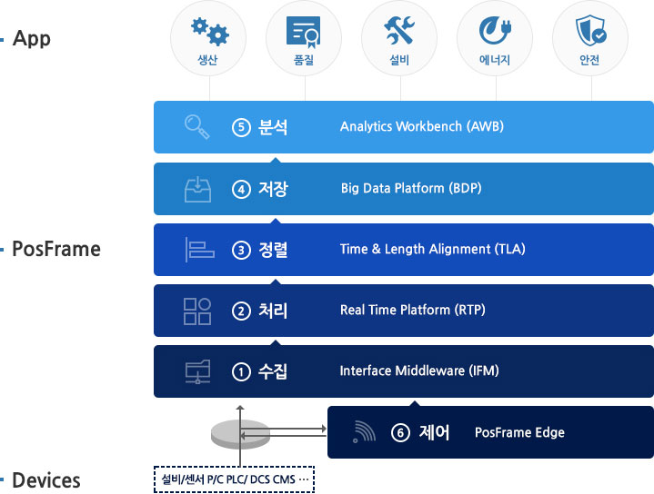
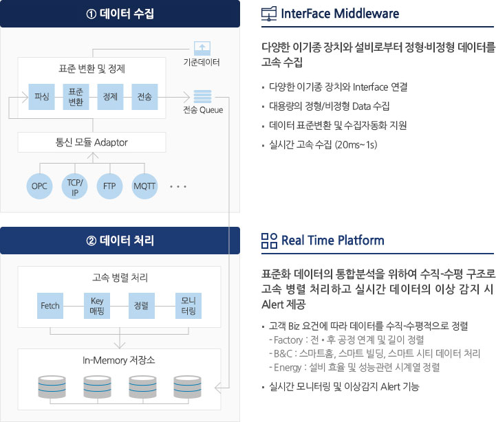
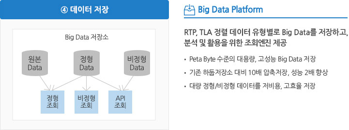
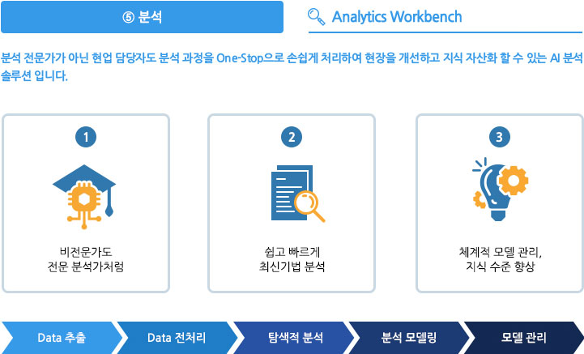
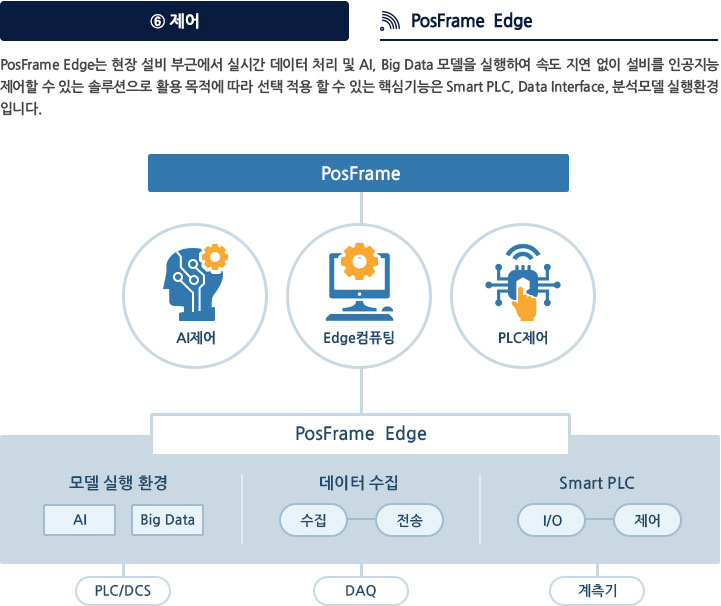
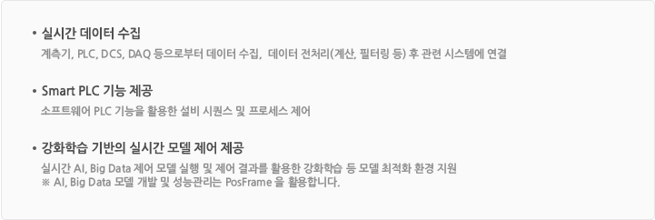
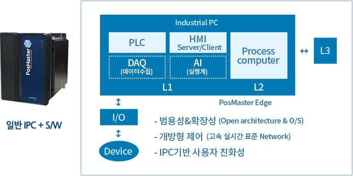
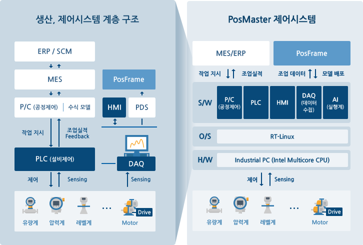
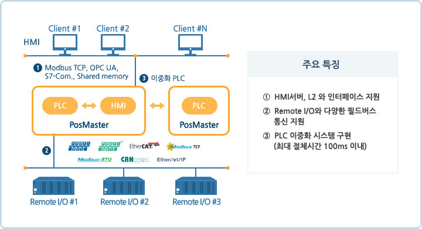

# Smart Factory
## 스마트팩토리 개요
- **스마트공장**이란 설계, 개발, 제조, 유통, 물류 등 **생산제조기술에 정보통신기술(ICT)를 결합**하여 **실시간으로 데이터를 수집하여 분석**하고 작업을 용이하도록 하여 생산성, 품질, 고객만족도 등을 향상시킬 수 있는 **고객맞춤형제품**을 생산하는 **지능형 공장**을 의미한다.
- 모든 제조 과정이 효율적으로 변한다
  - 기획 및 설계: 가상공간에서 제품 제작 전 시뮬레이션 -> 기간단축, 맞춤형 제품 개발
  - 생산: 설비-자재-시스템 간 실시간 정보 교환 -> 다품종 대량생산, 에너지 설비효율 재고
  - 유통 및 판매: 생산 현황에 맞춘 실시간 자동 수발주 -> 재고비용 감소, 품질-물류 등 전 분야 협력

## 스마트팩토리로 가야하는 이유?
- 인력의 부족, 오프라인 업무체계의 부재, 공급사의 역량 부족 등 시간의 효율성을 고려해야한다.
- 설비 데이터를 실시간으로 수집
- 최근, 다양한 통신방식이 IOT보급의 필요성을 대두로 산업설비에 보편적인 방식으로 설계되어 기술을 제공한다.
- PLC로부터 데이터를 수집하는 방식도 이더넷 통신포트가 자동제공되기 때문에 훨씬 데이터 수집이 예전에 비해 간단해졌다.
- 기술은 결국 사람을 향해가고있고, 효율을 추구하는 인간의 본성으로 인하여 데이터와 자동화라는 기반 기술의 확대를 지속 요구한다.

## 프로세스?
- 계속해서 실행하고 있는 컴퓨터 프로그램
- 프로그램과 달리, 하드 디스크에 저장되어 있는 코드가 아닌 메모리에서 실행되고 있는 작업의 단위를 프로세스라 부른다.

## PosFrame?
- PosFrame(포스프레임)은 생산현장의 정형/비정형 데이터를 실시간으로 수집하여, 데이터에 기반한 분석과 AI를 활용하여 최적으로 제어할 수 있는 스마트 플랫폼이다.
- 중후장대, 연속공정의 세계 최초이자 가장 앞선 플랫폼으로 클라우드 기반으로 제공 가능합니다.

### 특징
- 실시간 데이터 기반 의사결정 지원 체계
  - 다양한 IoT센서에서 발생한 데이터의 실시간 수집-분석-제어 기술을 통하여 데이터기반 의사결정을 지원한다.
- 스마트팩토리 IT신기술 All-in-One 플랫폼
  - IoT, Big Data, AI 등 IT 신기술 기반의 실시간, 무중단 스마트팩토리 통합 플랫폼으로, 미래 IT신기술을 지속적으로 적용한다.
- 연속공정에 성공적 적용, 산업 전 분야로 확장
  - 고속 연속공정에서 단위 설비/공정 발생 대용량 데이터를 수평-수직적으로 분석하여 전후공정 간 추적 분석, 관리가 가능하다. 생산 소요시간 단축, 품질확보, 설비효율향상, 에너지 최적화, 선제적 안전관리 등 산업 전 분야에 사용할 수 있습니다.

### 주요 기능

### 부가기능
- 포탈 (Smart Factory Portal)
  - 스마트 App을 손쉽게 제공하는 앱스토어와 실시간 생산 현황 지표를 한눈에 확인하고 개인 맞춤형 지표, 차트 및 대쉬보드를 제공하는 3D 공장 Layout을 제공합니다.

### 출처
> https://www.poscoict.com/solution/solution01.jsp

## 스마트 팩토리의 두뇌 PLC
### PLC란?
- 산업 현장에서 정해진 순서와 조건에 따라 기계를 동작하게 하는 제어장치이다.
- 신호를 입력하면 프로그램 연산을 통하여 출력 장치인 기계를 움직이거나 제어할 수 있다.
- 이는 컴퓨터와 유사한데, 산업 현장의 기기들은 대부분 온-오프, 수치, 시간 제어 등의 한정적인 동작을 반복수행한다.
- PLC는 한정적 수행동작과 순서를 미리 저장해 두었다가 프로그램 연산과 신호의 입출력을 통해 동작을 실행시키는 것이다.
- 만약, 동작조건이나 순서를 변경하고 싶다면 프로그램을 수정하면 된다.

### 릴레이조직, PLC (Programmable Logic Controller)
- 릴레이로직은 하드웨어 기반이지만, PLC는 소프트웨어 기반이다. 이로서, 배선이 복잡하고, 제어 환경을 변경하기 위해서 배선을 모두 재구성을 해야했던, 릴레이 로직의 불편함을 해소한 것이 PLC이다.

### HMI (Human Machine Interface)
- 시각이나 청각과 관련 지어낸 인간의 아날로그적인 인지의 세계와 컴퓨터나 통신의 디지털을 처리하는 기계의 세계를 연결하는 인터페이스

## PosMaster?
- PosMaster는 철강, 제조 공장 자동화 및 산업현장 설비시스템의 디지털화를 추진해온 포스코ICT만의 Know-how를 기반으로 탄생되었다. 산업현장의 자동화 시스템에서 요구되는 핵심기능(PLC, HMI)을 통합할 수 있는 IPC기반의 제어시스템이다.

### 기능
- PLC(Programmable Logic Controller)
  - 국제표준에 맞춰 프로그래밍하고, 표준 통신 프로토콜에 따른 I/O 인터페이스를 유연하게 구성
- HMI(Human Machine Interface)
  - 다양하게 발생하는 데이터들을 가시화 하여 사용자가 원하는 형태의 HMI 구현
- P/C(Process Computer)
  - L3레벨(MES)과 데이터 송수신, 공정제어, 수식모델 등
- PosFrame에서 학습된 AI(Artificial Intelligence)/빅데이터(Big data) 모델을 PLC 머신에서 실행할 수 있는 기능
- DAQ(Data Acquisition)
  - 다양한 데이터를 가시화하여 사용자가 원하는 형태의 HMI를 구현

### 구성
- PosMaster는 PosMaster-PLC와 PosMaster-HMI로 구성되며, 동일한 플랫폼에 Modular 구조로 구현합니다. PosMaster의 PLC와 HMI는 고속으로 대용량의 I/O 데이터를 처리하며, 이중화에 의한 안정적인 시스템 운영을 지원한다.

- PosMaster-PLC
  - Multi-core CPU를 탑재한 고성능의 IPC 사용으로 자동화에 필요한 다양한 기능과 Edge 컴퓨팅 지원이 가능합니다. 또, 국제산업표준(IEC61131-3)에 준거하여 기존 PLC와 동일한 언어 사용이 가능하다.

- PosMaster-HMI
  - 검증된 오픈 소스 기반으로 개발하였으며, 편리한 화면 작성, API 기반 기능 통합, 데이터 수집, Trend Alarm 기능을 구현하여 기존 고가의 외국 HMI 개발 Tool을 대체할 수 있습니다.

### 특징
- 최적의 Smart Factory 환경 구현
  - IPC 기반의 고속 Data 처리 환경을 제공해 Smart Factory 활용성을 높이며, 기존 PLC가 구현하지 못했던 여러가지 분석 Package 및 Model 등을 통합 운영할 수 있습니다. 또한 loT,AI,Digital Twin 등 Smart Factory 구현에 필요한 신기술 연동이 용이한 구조를 구현해 드립니다.
- 효율적인 비용절감 효과
  - 오픈소스 기반의 SW 중심 제품으로, 어떤 H/W에도 탑재 가능한 유연성을 지니고 있습니다. 하나의 CPU 에 여러 개(최대 4개)의 제어기 통합구성으로 별도의 H/W 구매 비용 절감이 가능합니다.
- 풍부한 레퍼런스 기반 특화된 서비스 제공
  - 철강 공정제어 엔지니어링의 풍부한 경험을 기반으로 특화된 Library를 제공하고, 엔지니어링 기간을 단축해 드립니다. 또한 특정 Maker에 종속되지 않는 Remote I/O와 다양한 필드통신을 제공하여 범용성을 확보해 드립니다.
- 안정적인 O&M 서비스 제공
  - 리눅스 OS로 Windows형태의 바이러스에 잘 감염되지 않아 보안성이 우수합니다. 프로그램 수정시에는 자체 Simulation, Trend, Visualization 기능을 활용하여 사전 검증이 용이합니다.

### 출처
> https://www.poscoict.com/solution/solution06.jsp

## 데이터 분석
- 최근 빅데이터는 인사이트를 찾기 위한 데이터 분석에 활용되고 있다. 

### 데이터 분석 프로세스
1. 데이터 요구사항 수집
- 먼저 데이터 분석을 하는 이유에 대해 신중하게 생각해야 합니다. 분석의 목적이 무엇인지, 어떤 종류의 데이터 분석을 수행해야 하는지 결정해야 합니다.
2. 빅데이터 수집
- 회사의 운영체제는 많은 양의 데이터나 엑셀 데이터가 수집되지만 양이 너무 많아지면 데이터 수집이 번거롭기 때문에 ERP/OA/MES와 같은 비지니스 시스템의 데이터를 하나의 플랫폼으로 쉽게 통합하여 조직의 정보 사일로를 차단합니다.
- ERP
  - 주문에 맞는 생산에 필요한 자재의 양과 해당 주문에 대한 제조물이 언제 공장에서 발송되어야 하는지 정보 제공
  - 생산 데이터 수집 지원
  - 얻을 수 있는 정보
    - 병목 발생 지점과 이 현상으로 생산 일정에 미치는 영향에 대한 정보
    - 기계 유지보수 활동, 품질관리, 생산 공정 중에 있는 미완성 제품 및 생산 일정에 대한 실시간 정보 제공
- MES
  - AI기반 프로세스 컨트롤로 생산 과정을 자동으로 융합하고 스마트한 자산 활용 현황 모니터링 & 예측 유지보수 솔루션으로 유지보수 프로토콜을 최적화
  - 주문 자동 다운로드 및 실행으로 공급망과 공장 현장 연결
> https://www.rockwellautomation.com/ko-kr/capabilities/mes/mes-vs-erp.html

3. 데이터 클리닝
- 지금까지 수집된 데이터는 분석 목적과 관련이 없거나 쓸모가 없을 수 있으므로 데이터 정제가 필요합니다. 수집된 데이터에는 중복기록, 공백 또는 오류가 포함될 수 있습니다.​​ 데이터 정제를 기반으로 하면 분석 결과가 예상 결과에 더 가까우므로 정제작업은 데이터 분석 전에 수행해야 합니다.

4. 데이터 분석
- 데이터의 수집, 정제처리 후 분석작업을 진행하면 됩니다． 데이터를 처리할 때 분석에 필요한 정확한 정보를 얻거나 관련된 더 많은데이터를 수집해야 할 수 있습니다. 이 단계에서 데이터 분석 툴과 소프트웨어를 사용하여 요구 사항을 이해하고 해석하고 결론을 도출할 수도 있습니다.

5. 데이터 해석
- 텍스트, 표 또는 그래프를 사용하는 데이터 분석 방법을 선택할 수 있습니다. 다음으로, 데이터 분석 프로세스의 결과를 사용하여 최상의 실행방안을 결정합니다.

6. 데이터 시각화
- 데이터 시각화는 일상생활에서 매우 일반적입니다. 데이터 시각화는 일반적으로 차트와 그래프의 형태로 제공됩니다. 즉, 데이터가 그래픽으로 표시되어 인간의 두뇌가 더 쉽게 이해하고 처리할 수 있습니다. 데이터 시각화는 종종 미발견된 사실과 추세를 발견하는데사용됩니다. 관계를 살펴보고 데이터 세트를 비교함으로써 의미 있는 정보를 찾는 방법을 찾을 수 있습니다.

### 데이터 분석 툴
- Python, R, SPSS, Excel, MATLAB 등

### 기업에서 데이터 분석을 사용하는 이유?
- 데이터 분석은 기업에서 더 나은 비즈니스 결정을 내리도록 돕기 위해 사용됩니다. 시장 조사, 제품 조사, 포지셔닝, 고객 리뷰, 감정 분석 또는 데이터가 존재하는 다른 문제든, 데이터 분석은 기업이 올바른 선택을 하기 위해 필요한 통찰력을 제공할 것입니다.
- 빅데이터는 오늘날의 비즈니스에 매우 중요하며, 다양한 데이터 분석 방법을 사용하여 통찰력을 긍정적인 행동으로 바꿀 수 있는 방식으로 데이터를 볼 수 있습니다.

### 빅데이터 분석
- 데이터 분석은 비즈니스 의사결정에 유용한 정보를 찾기 위한 데이터 정리, 변환, 모델링(modeling) 과정으로 정의됩니다. 데이터 분석의 목적은 데이터에서 유용한 정보를 추출하고 데이터 분석에 기초하여 결정을 내리고 인사이트를 도출하는 것입니다.

### 출처
> https://www.finereport.com/kr/%EB%8D%B0%EC%9D%B4%ED%84%B0-%EB%B6%84%EC%84%9D/

