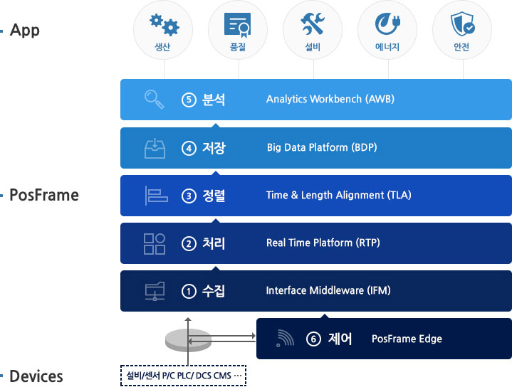
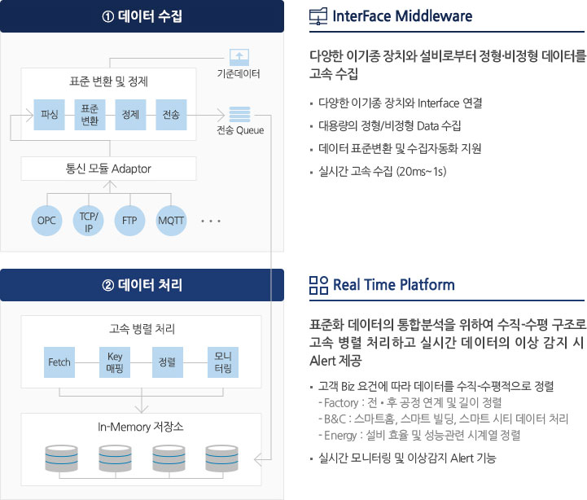
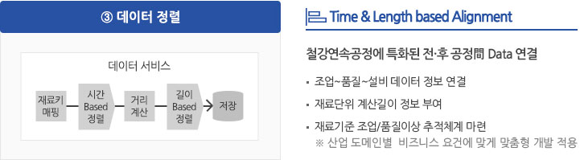
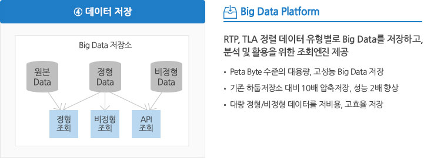
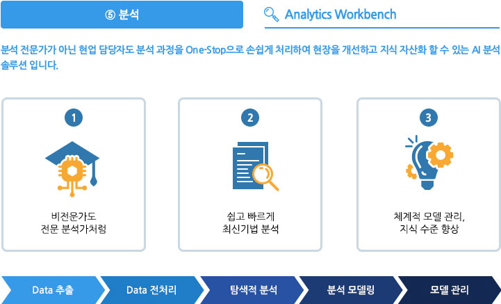
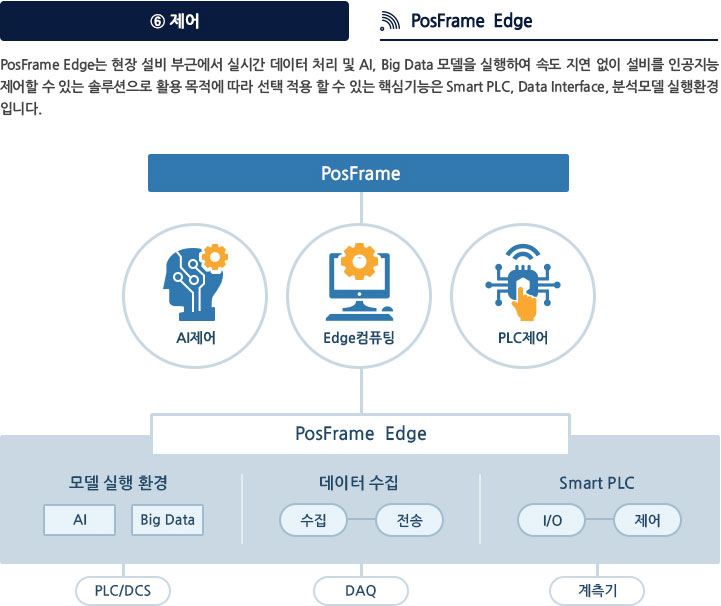
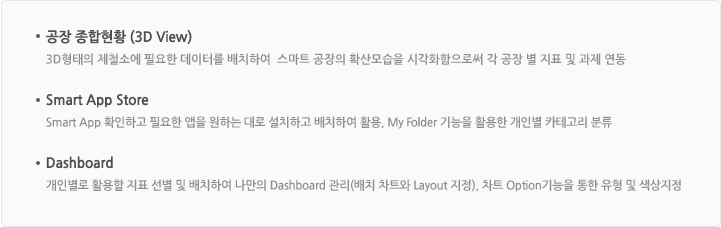
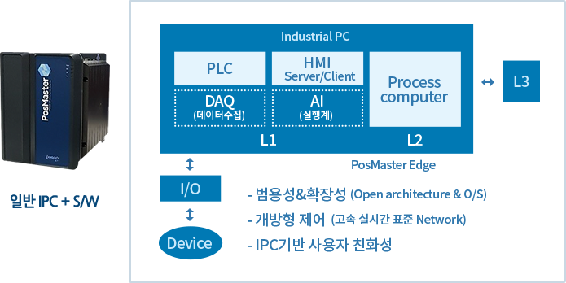
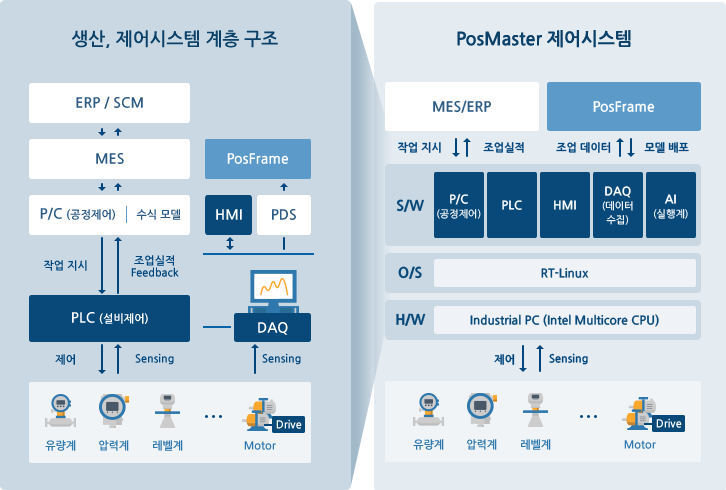
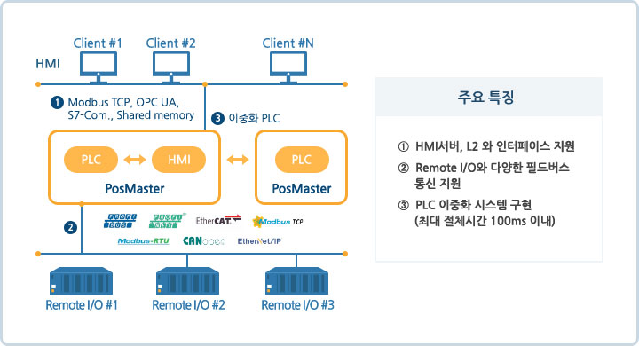

# Smart Factory
## 스마트팩토리 개요
- **스마트공장**이란 설계, 개발, 제조, 유통, 물류 등 **생산제조기술에 정보통신기술(ICT)를 결합**하여 **실시간으로 데이터를 수집하여 분석**하고 작업을 용이하도록 하여 생산성, 품질, 고객만족도 등을 향상시킬 수 있는 **고객맞춤형제품**을 생산하는 **지능형 공장**을 의미한다.
- 모든 제조 과정이 효율적으로 변한다
  - 기획 및 설계: 가상공간에서 제품 제작 전 시뮬레이션 -> 기간단축, 맞춤형 제품 개발
  - 생산: 설비-자재-시스템 간 실시간 정보 교환 -> 다품종 대량생산, 에너지 설비효율 재고
  - 유통 및 판매: 생산 현황에 맞춘 실시간 자동 수발주 -> 재고비용 감소, 품질-물류 등 전 분야 협력

## 스마트팩토리로 가야하는 이유?
- 인력의 부족, 오프라인 업무체계의 부재, 공급사의 역량 부족 등 시간의 효율성을 고려해야한다.
- 설비 데이터를 실시간으로 수집
- 최근, 다양한 통신방식이 IOT보급의 필요성을 대두로 산업설비에 보편적인 방식으로 설계되어 기술을 제공한다.
- PLC로부터 데이터를 수집하는 방식도 이더넷 통신포트가 자동제공되기 때문에 훨씬 데이터 수집이 예전에 비해 간단해졌다.
- 기술은 결국 사람을 향해가고있고, 효율을 추구하는 인간의 본성으로 인하여 데이터와 자동화라는 기반 기술의 확대를 지속 요구한다.

## 프로세스?
- 계속해서 실행하고 있는 컴퓨터 프로그램
- 프로그램과 달리, 하드 디스크에 저장되어 있는 코드가 아닌 메모리에서 실행되고 있는 작업의 단위를 프로세스라 부른다.

## PosFrame?
- PosFrame(포스프레임)은 생산현장의 정형/비정형 데이터를 실시간으로 수집하여, 데이터에 기반한 분석과 AI를 활용하여 최적으로 제어할 수 있는 스마트 플랫폼이다.
- 중후장대, 연속공정의 세계 최초이자 가장 앞선 플랫폼으로 클라우드 기반으로 제공 가능합니다.

### 특징
- 실시간 데이터 기반 의사결정 지원 체계
  - 다양한 IoT센서에서 발생한 데이터의 실시간 수집-분석-제어 기술을 통하여 데이터기반 의사결정을 지원한다.
- 스마트팩토리 IT신기술 All-in-One 플랫폼
  - IoT, Big Data, AI 등 IT 신기술 기반의 실시간, 무중단 스마트팩토리 통합 플랫폼으로, 미래 IT신기술을 지속적으로 적용한다.
- 연속공정에 성공적 적용, 산업 전 분야로 확장
  - 고속 연속공정에서 단위 설비/공정 발생 대용량 데이터를 수평-수직적으로 분석하여 전후공정 간 추적 분석, 관리가 가능하다. 생산 소요시간 단축, 품질확보, 설비효율향상, 에너지 최적화, 선제적 안전관리 등 산업 전 분야에 사용할 수 있습니다.

### 주요 기능

### 부가기능
- 포탈 (Smart Factory Portal)
  - 스마트 App을 손쉽게 제공하는 앱스토어와 실시간 생산 현황 지표를 한눈에 확인하고 개인 맞춤형 지표, 차트 및 대쉬보드를 제공하는 3D 공장 Layout을 제공합니다.

### 출처
> https://www.poscoict.com/solution/solution01.jsp

## 스마트 팩토리의 두뇌 PLC
### PLC란?
- 산업 현장에서 정해진 순서와 조건에 따라 기계를 동작하게 하는 제어장치이다.
- 신호를 입력하면 프로그램 연산을 통하여 출력 장치인 기계를 움직이거나 제어할 수 있다.
- 이는 컴퓨터와 유사한데, 산업 현장의 기기들은 대부분 온-오프, 수치, 시간 제어 등의 한정적인 동작을 반복수행한다.
- PLC는 한정적 수행동작과 순서를 미리 저장해 두었다가 프로그램 연산과 신호의 입출력을 통해 동작을 실행시키는 것이다.
- 만약, 동작조건이나 순서를 변경하고 싶다면 프로그램을 수정하면 된다.

### 릴레이조직, PLC (Programmable Logic Controller)
- 릴레이로직은 하드웨어 기반이지만, PLC는 소프트웨어 기반이다. 이로서, 배선이 복잡하고, 제어 환경을 변경하기 위해서 배선을 모두 재구성을 해야했던, 릴레이 로직의 불편함을 해소한 것이 PLC이다.

### HMI (Human Machine Interface)
- 시각이나 청각과 관련 지어낸 인간의 아날로그적인 인지의 세계와 컴퓨터나 통신의 디지털을 처리하는 기계의 세계를 연결하는 인터페이스

## PosMaster?
- PosMaster는 철강, 제조 공장 자동화 및 산업현장 설비시스템의 디지털화를 추진해온 포스코ICT만의 Know-how를 기반으로 탄생되었다. 산업현장의 자동화 시스템에서 요구되는 핵심기능(PLC, HMI)을 통합할 수 있는 IPC기반의 제어시스템이다.

### 기능
- PLC(Programmable Logic Controller)
  - 국제표준에 맞춰 프로그래밍하고, 표준 통신 프로토콜에 따른 I/O 인터페이스를 유연하게 구성
- HMI(Human Machine Interface)
  - 다양하게 발생하는 데이터들을 가시화 하여 사용자가 원하는 형태의 HMI 구현
- P/C(Process Computer)
  - L3레벨(MES)과 데이터 송수신, 공정제어, 수식모델 등
- PosFrame에서 학습된 AI(Artificial Intelligence)/빅데이터(Big data) 모델을 PLC 머신에서 실행할 수 있는 기능
- DAQ(Data Acquisition)
  - 다양한 데이터를 가시화하여 사용자가 원하는 형태의 HMI를 구현

### 구성
- PosMaster는 PosMaster-PLC와 PosMaster-HMI로 구성되며, 동일한 플랫폼에 Modular 구조로 구현합니다. PosMaster의 PLC와 HMI는 고속으로 대용량의 I/O 데이터를 처리하며, 이중화에 의한 안정적인 시스템 운영을 지원한다.

- PosMaster-PLC
  - Multi-core CPU를 탑재한 고성능의 IPC 사용으로 자동화에 필요한 다양한 기능과 Edge 컴퓨팅 지원이 가능합니다. 또, 국제산업표준(IEC61131-3)에 준거하여 기존 PLC와 동일한 언어 사용이 가능하다.

- PosMaster-HMI
  - 검증된 오픈 소스 기반으로 개발하였으며, 편리한 화면 작성, API 기반 기능 통합, 데이터 수집, Trend Alarm 기능을 구현하여 기존 고가의 외국 HMI 개발 Tool을 대체할 수 있습니다.

### 특징
- 최적의 Smart Factory 환경 구현
  - IPC 기반의 고속 Data 처리 환경을 제공해 Smart Factory 활용성을 높이며, 기존 PLC가 구현하지 못했던 여러가지 분석 Package 및 Model 등을 통합 운영할 수 있습니다. 또한 loT,AI,Digital Twin 등 Smart Factory 구현에 필요한 신기술 연동이 용이한 구조를 구현해 드립니다.
- 효율적인 비용절감 효과
  - 오픈소스 기반의 SW 중심 제품으로, 어떤 H/W에도 탑재 가능한 유연성을 지니고 있습니다. 하나의 CPU 에 여러 개(최대 4개)의 제어기 통합구성으로 별도의 H/W 구매 비용 절감이 가능합니다.
- 풍부한 레퍼런스 기반 특화된 서비스 제공
  - 철강 공정제어 엔지니어링의 풍부한 경험을 기반으로 특화된 Library를 제공하고, 엔지니어링 기간을 단축해 드립니다. 또한 특정 Maker에 종속되지 않는 Remote I/O와 다양한 필드통신을 제공하여 범용성을 확보해 드립니다.
- 안정적인 O&M 서비스 제공
  - 리눅스 OS로 Windows형태의 바이러스에 잘 감염되지 않아 보안성이 우수합니다. 프로그램 수정시에는 자체 Simulation, Trend, Visualization 기능을 활용하여 사전 검증이 용이합니다.

### 출처
> https://www.poscoict.com/solution/solution06.jsp

