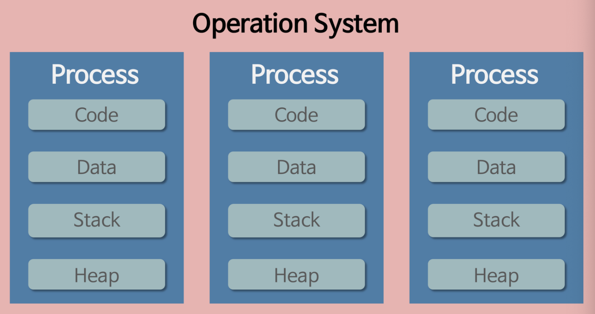
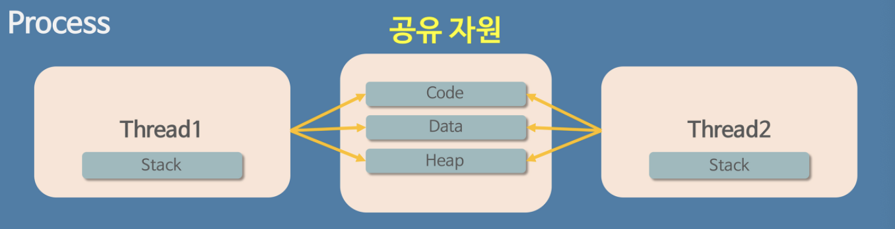
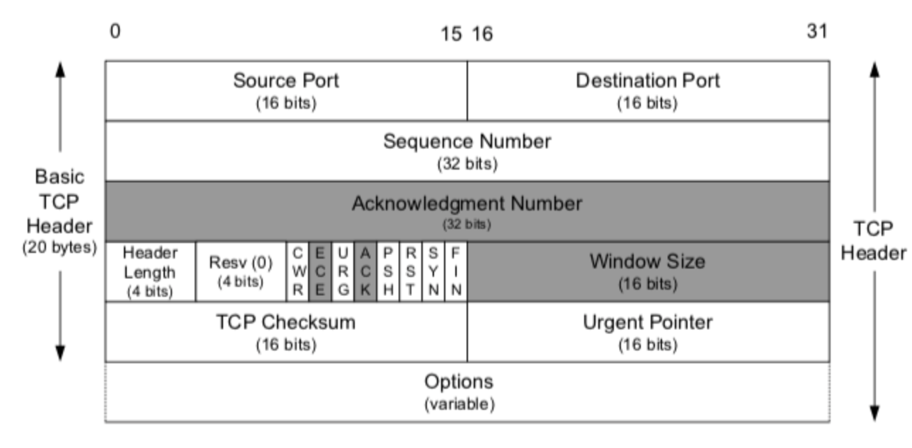
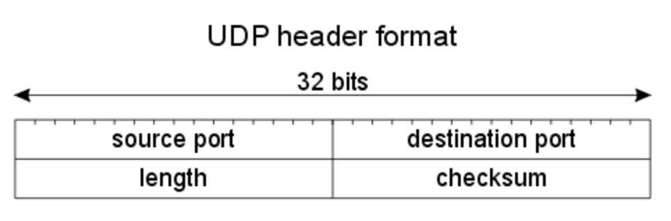
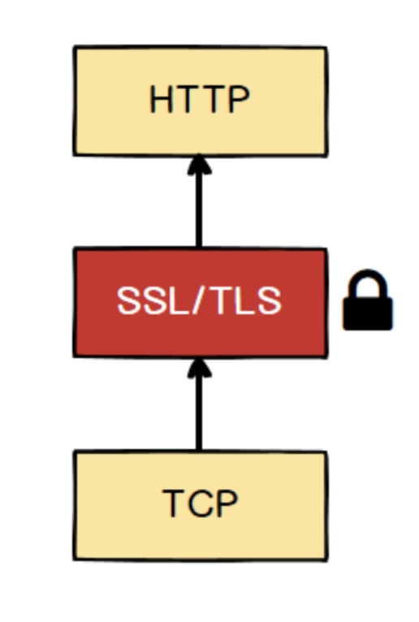
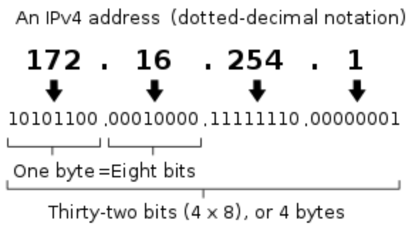
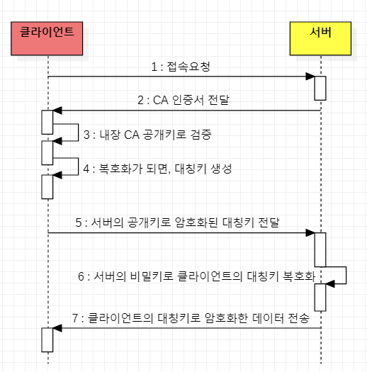

# 네트워크
## 1. https://www.google.com/ 을 접속할 때 일어나는 일
1. 브라우저가 URL에 적힌 값을 파싱해서 HTTP Request Message를 만들고, OS에 전송요청을 합니다. 이때 Domain으로 요청을 보낼 수 없기 때문에 DNS Lookup을 수행합니다.
2. DNS Lookup\
크롬: 브라우저 -> host파일 -> DNS Cache의 순서로 Domain에 매칭되어 ip를 찾습니다.\
일반적인 DNS룩업: 루트 도메인서버에서부터 서브도메인 서버순으로 찾게된다.
3. HTTP Request Message는 프로토콜 스택이라는 OS에 내장된 네트워크 제어용 소프트웨어에 의해서 패킷에 담기고 패킷에 제어 정보를 붙여 LAN 어댑터를 전송하고 이를 전기 신호로 변환시켜 송출한다.
4. 패킷은 스위칭 허브 등을 경유하여 인터넷 접속용 라우터에서 ISP로 전달되고 인터넷으로 이동합니다.
5. 엑세스 회선에 의해 통신사용 라우터로 운반되고 인터넷의 핵심부로 전달됩니다. 고속 라우터들 사이로 목적지까지 패킷이 흘러들어가게 됩니다.
6. 핵심부를 통과한 패킨은 목적지의 LAN에 도착하고, 방화벽이 패킷을 검사한 후 캐시 서버로 보내어 웹 서버에 갈 필요가 있는지 검사합니다.
7. 웹 서버에 도착한 패킷은 프로토콜 스택이 패킷을 추출하여 메시지를 복원하고 웹 서버 애플리케이션에 넘깁니다. 애플리케이션은 요청에 대한 응답 데이터를 작성하고 클라이언트로 회송하고, 이는 전달된 방식 그대로 전송됩니다.

## 2. 프로그램 vs 프로세스 vs 스레드
### 프로그램
#### 설명: 
어떤 작업을 위해 실행할 수 있는 파일입니다.\ 파일이 저장 장치에 저장되어 있지만, 메모리에는 올라가 있지 않은 정적인 상태입니다. (그냥 코드 덩어리)
### 프로세스
- 
#### 설명:
1. 코드 덩어리인 프로그램을 실행한 것 -> 동적인 상태의 프로그램\
   메모리에 올라와 실행되고 있는 프로그램의 인스턴스로 독립적인 개체입니다. 
2. 실행파일을 클릭했을 때, 메모리할당이 이루어지고, 이 메모리 공간으로 코드가 올라갑니다.\
   이 순간부터는 '프로세스'라 불리게 됩니다.
#### 특징
1. 프로세스는 각각 독립된 메모리 영역(Code, Data, Stack, Heap)을 운영체제로부터 할당 받기때문에 변수나 자료구조에 직접 접근이 불가합니다.
2. 프로세스는 기본적으로 최소 1개의 스레드를 가지고 있습니다
3. 다른 프로세스의 자원에 접근하기 위해서 IPC(Inter-Process Communication)을 사용해야 합니다.\
ex) Pipe, File, Socket, etc.
### 멀티 프로세스
#### 설명:
하나의 프로그램을 여러 개의 프로세스로 구성하여, 각 프로세스가 하나의 작업을 처리하는 것입니다. 즉, 하나의 운영체제 안에서 여로 프로세스가 실행되는 것입니다.
### 스레드
- 
#### 설명:
1. 프로세스 코드에 정의된 절차에 따라 실행되는 특정한 수행 경로
2. 프로세스가 할당받은 자원을 이용하는 실행단위
#### 특징:
1. 프로세스 안에서 Stack만 따로 할당받고, Code, Data, Heap영역은 공유한다.
2. 같은 프로세스 내의 주소 공간, 자원을 공유한다.
3. 프로세스 내의 한 스레드가 프로세스 자원을 변경하면, 다른 이웃 스레드도 그 변경 결과를 즉시 확인할 수 있다.
### 멀티 스레드
#### 설명:
프로그램을 여러 개의 스레드로 구성하여, 각 스레드가 작업을 처리하는 것입니다. 즉, 하나의 프로세스가 여러 작업을 여러 스레드를 사용하여 동시에 처리하는 것입니다.
#### 장점:
스레드간 Code, Data, Heap 공유로 인하여 응답 시간이 빠르고, 시스템 자원소모와 처리 비용이 감소한다.
#### 단점:
자원을 공유하기 때문에 동기화 이슈가 발생할 수 있습니다. 하나의 스레드 오류로 인하여 전체 프로세스에 문제가 발생할 수 있습니다.

## 3. TCP vs UDP
### TCP (Transmission Control Protocol)
- Header
- 

#### 설명:
1. 인터넷 상에서 데이터를 메시지의 형태로 보내기 위해 IP와 함께 사용하는 프로토콜입니다.
2. TCP는 응용 계층으로부터 받은 데이터에 Header를 추가한 뒤 IP로 보낸다.
3. TCP 서버의 특징
- TCP서버와 클라이언트는 1:1로 연결된다.
- 전송 데이터의 크기가 무제한이다. 스트림으로 데이터를 전송한다.
- 패킷에 대한 응답을 하기 때문에 성능이 낮다. (시간 지연, CPU 소모)
- 패킷이 손실된 경우 재전송을 요청하기 때문에 스트리밍 서비스에는 부적합하다.

#### 특징:
1. 연결형 서비스\
연결형 서비스로 가상 회선 방식을 제공한다.
- 가상 회선 방식: 발신지와 수신지를 연결하여 패킷 전송하기 위한 논리적 경로를 배정한다는 의미입니다.
- 3-way handshaking[SYN, SYN+ACK, ACK]: 목적지와 수신지를 확실히 정하여 정확한 전송을 보장하기 위해 세션을 수립한다. (TCP Connection)
- 
- 3-way handshake은 SYN FLOODING 공격을 받을 수 있다.
- 4-way handshaking[FIN, ACK, FIN, ACK]: 세션을 해제한다. (TCP Disconnection)
- 

2. 흐름 제어\
데이터 처리 속도를 조절하여 수신자의 버퍼 오버플로우를 방지한다
- 송신지가 과도한 데이터를 빠르게 보내는 것을 막아 수신지의 문제 발생을 방지한다.
- 수신지가 Window Size값을 조절하여 수신량을 정할 수 있다.

3. 혼잡제어\
네트워크 내의 패킷 수가 넘치지 않게 방지한다.
- 정보의 소통량이 과다할 경우, 패킷 전송량을 줄여 혼잡 붕괴 현상을 막는다. (CPU가 사용하는 흐름제어, 혼잡제어기능때문에 UDP보다 속도가 느리게 된다)

4. 신뢰성 높은 전송
- 정상적인 상황에서 ACK 패킷이 연속적으로 전송되어야 한다.
- ACK 패킷이 중복수신되면 패킷 이상을 감지하고 재전송을 요청한다.
- 일정시간동안 ACK 패킷 수신을 못하면 재전송을 요청한다.

5. 전이중, 점대점 방식
- 전이중(Full-Duplex): 전송이 양방향으로 동시에 일어날 수 있다.
- 점대점(PointToPoint): 각 연결이 정확히 2개의 종단점을 가진다. (멀티캐스팅, 브로드캐스팅 지원 X)

### UDP (User Datagram Protocol)
- Header
- 

#### 설명:
1. 데이터를 데이터그램 단위로 처리하는 프로토콜이다.
2. 비연결성 프로토콜로 연결을 위해 할당되는 논리적 경로가 없기 때문에, 각각의 패킷은 독립적인 관계를 지니며 다른 경로로 전송되고 독립적으로 처리된다.
3. 인터넷 상에서 정보를 주고 받을 때, 정보를 신호를 절차없이 일방적으로 보낸다.
4. UDP 서버의 특징
- 연결자체가 없기에 서버 소켓, 클라이언트 소켓의 구분이 없다.
- 소켓이 아닌 IP 기반으로 데이터를 전송한다.
- 1:1, 1:N, N:M 등으로 연결될 수 있다.
- 흐름 제어가 없다. (패킷이 제대로 전송되었는지 확인 불가)
- 신뢰성보다 성능이 중요한 서비스에 사용된다.

#### 특징:
1. 제약조건이 거의 없고, TCP보다 속도가 매우 빨라 실시간 전송이 필요한 부분에 많이 사용된다.\
ex) 인터넷 전화, 스트리밍 서비스
2. UDP는 connection, disconnection 등 복잡한 트랜잭션이 필요없다.
3. 전송, 수신측의 양방 검증이 필요한 TCP와는 다르게 UDP에서는 멀티캐스트, 브로드캐스트가 가능하다.

### 공통점
- 포트 번호를 이용하여 주소를 지정한다.
- 데이터 오류 검사를 위한 checksum이 존재한다.

## HTTP vs HTTPS
### 공통점
- TCP/IP의 최상위 계층에서 서버/클라이언트간 리소스 요청 및 제공을 담당하는 프로토콜이다.
- 상태를 유지하지 않는 Stateless Protocol이다.
- 많은 데이터를 빠르고 확실하게 처리하는 범용성을 확보하기 위해서 상태를 유지하지 않는다.
- 쿠키/세션 또는 토큰 방식의 OAuth/JWT를 사용하여 HTTP 통신에서 상태를 관리할 수 있다.

### HTTP (HyperText Transfer Protocol)
#### 정보:
- 서로 다른 시스템들 사이에서 통신을 주고받게 해주는 가장 기초적인 프로토콜이다.
- 서버에서 클라이언트로 데이터를 전송해주는 용도로 많이 사용된다.
- 인터넷 초기의 모든 웹사이트에서 기본적으로 사용된 프로토콜이다.
- 80포트를 사용한다.

### HTTP/1.0
#### 정보:
- 비연결지향 프로토콜이다.
  - HTTP 통신을 할 때마다 TCP에 의해 연결/종료된다.
  - 연결상태를 유지하기 위해서 Request Header의 Connection 정보에 keep-alive를 적용하기도 한다.
### HTTP/1.0 이후
#### 정보:
- 지속 연결, 파이프 라이닝
  - 지속연결: 서버 또는 클라이언트가 명시적으로 연결을 종료하지 않는 이상 TCP연결을 계속 유지한다.
  - 파이프라이닝: 클라이언트가 서버에게 Request를 병행해서 보낼 수 있다. (Communication Latency 감소)
### HTTP와 TCP/IP의 문제점
- 서버에서 클라이언트로 전송되는 데이터가 암호화되지 않는 평문 통신을 하기 때문에 도청을 할 수 있다.
- 완전성을 증명할 수 없기에 변조가 가능하다는 보안 취약점을 가진다.
- 통신 상대를 확인하지 않기 때문에 위장이 가능하다.

### HTTPS (HyperText Transfer Protocol Secure)
- 

#### HTTPS는 HTTP의 일반 텍스트에 SSL이나 TSL 프로토콜을 씌워 데이터를 암호화하는 기법으로 HTTP의 보안 문제를 보안한 프로토콜이다.
- HTTP통신하는 소켓 부분을 SSL(Secure Socket Layer) 또는 TSL(Transport Layer Security)라는 프로토콜로 대체한 것이다.
- HTTP는 TCP와 직접 통신하지만, HTTPS에서는 HTTP는 SSL과 통신하고, SSL이 TCP와 통신한다.
- SSL을 사용한 HTTPS는 암호화, 증명서, 안전성 보호를 이용할 수 있다.
- HTTP와는 다르게 433포트를 사용한다.

#### 동작방식
1. 클라이언트가 서버에 접속요청을 하면 CA에서 받은 인증서를 보낸다.
2. 클라이언트는 인증서를 받아 CA의 공개키로 복호화하여 접속 요청 서버가 신뢰할만한지 검증한다.
3. 복호화가 완료되면 인증서가 신뢰할만하기 때문에 클라이언트는 데이터를 주고 받을 대칭키를 생성한다.
4. 클라이언트는 대칭키를 서버의 공개키로 암호화하여 서버에게 전송한다.
5. 서버는 자신의 비밀키로 클라이언트가 보낸 대칭키를 복호화한 뒤 그 대칭키를 통해 데이터를 주고 받는다.

#### 특징
1. 기밀성: 인터넷과 같은 공공 매체에서 두 참여자 간의 통신을 보호한다.
2. 무결성: 정보를 변조되지 않게 목적지에 도달하게 한다.
3. 인증: HTTPS를 통해 웹사이트의 진위 여부를 확인할 수 있다.
4. 속도: HTTP보다 빠르다.


## 4. IP주소와 DNS
### IP
- 컴퓨터 네트워크에서 장치들이 서로 인식하고 통신을 하기 위해서 사용하는 특수한 번호.
### IPv4
- 
- 크기가 32비트인 주소값으로 대게 dotted-decimal notation을 이용하여 표기한다.
- dot으로 구분된 각 숫자는 8비트씩 나타낼 수 있으며 0 ~ 255의 범위를 나타낸다.

### IPv6
- IPv4의 32비트에서 128비트으로 증가하여 더 많은 IP주소를 할당할 수 있는 주소
- IPv4의 주소가 부족하게되어 더 많은 주소를 네트워크에 할당하기 위해서 Network Fragmentation이 지속적으로 증가하게되어 라우터에 많은 부담을 주고있어 
이를 해결하기 위해서 IPv6가 만들어진 것이다.

### DNS (Domain Name Service)
- Host의 도메인 이름을 네트워크 주소로 바꾸거나 그 반대의 변환을 수행할 수 있도록 하기위해서 개발된 것이다.
- Socket Library의 resolver을 호출하여 도메인 이름으로부터 네트워크 주소를 받아온다.
- DNS Name Server: DNS 데이터베이스 레코드를 저장하는 물리적 서버
- Resolver -> DNS서버에 조회 메시지를 보냄 -> DNS서버에서 응답 메시지를 받음
- 도메인의 계층
  - 예를 들어, www.google.com이 있다고 가정한다
  - com 도메인 -> google 도메인 -> www 도메인
  - com 도메인이 가장 상위이고, google 도메인은 com의 서브 도메인이되는것이다.
  - 서브 도메인은 127단계까지 가능하다.
- DNS에서 등록한 정보를 찾아내는 방법
  0. DNS 캐시와 hosts파일에서 도메인 정보가 있는지 확인한다. (없다면 1번과정으로)
  1. 가장 가까운 DNS 서버(로컬)에 www.google.com 도메인 정보 요청한다.
  2. 로컬 DNS 서버에 www.google.com에 대한 정보가 없기 때문에 루트 DNS서버에 다시 질의한다.
  3. 루트 DNS 서버는 www.google.com에 대한 정보가 없지만 com 도메인을 관리하고 있는 서버 정보를 알려준다.
  4. 로컬 DNS 서버는 www.google.com에 대한 정보를 com 도메인을 관리하고 있는 서버에 질의한다.
  5. com 도메인을 관리하고 있는 DNS 서버는 www.google.com에 대한 정보가 없지만 google 도메인을 관리하는 DNS 서버에 도달하여 정보를 확인할 수 있다.
  6. 로컬 DNS 서버는 www.google.com의 IP 정보를 사용자의 PC에게 알려준다.
  - DNS 캐시는 정확도를 위해서 일정 시간이 지나면 파기한다.
  - resolver에 의해서 IP 정보를 받아오면 DNS 캐시에 의한 정보인지 DNS 서버에 의한 정보인지 알 수 있다.

## 5. HTTPS와 SSL Handshake
### HTTPS
- 기존 HTTP에 보안 계층 프로토콜(SSL/TLS 프로토콜)을 추가하여 암호화한 프로토콜
#### 정보
- 새로운 애플리케이션 프로토콜은 아니다.
```
HTTP 통신하는 소켓 부분을 SSL(Secure Socket Layer) 또는 TLS(Transport Layer Security)라는 프로토콜로 대체한 것
```
- SSl 버전 3.1부터 TLS로 명칭이 변경되고 SSL과 TLS를 혼용하고 있다.
- HTTP ⇆ TCP
- HTTPS ⇆ SSL/TLS ⇆ TCP
- HTTPS는 제 3 자 인증, 공개키 암호화, 비밀키 암호화를 사용한다.
  - 제 3자 인증: 신뢰할 수 있는 인증기관에 등록된 인증서만 신뢰하는 것
  - 공개키 암호화: 비밀키를 공유하기 위해 사용
  - 비밀키 암호화: 통신하는 데이터를 암호화하기 위해 사용되는 방식

### SSL Handshake
- SSL이 데이터를 암호화하여 전달하는 방식이다.

1. 클라이언트가 서버에 접속한다. 이 단계를 "Client Hello"라고 한다.
2. 서버는 Client Hello에 대한 응답으로 "Server Hello"를 한다.
3. 클라이언트는 CA 인증서를 CA의 공개키로 복호화하여 접속 요청한 서버가 신뢰할만한지 검증한다.
4. 복호화가 되면 CA 인증서가 신뢰할 수 있기에 데이터를 주고 받을 대칭키를 생성한다.
5. 대칭키를 서버의 공개키(pre master secret)로 암호화하여 서버에 전송한다.
6. 서버는 자신의 비밀키로 클라이언트가 보낸 대칭키를 복호화한다.
7. 서버는 복호화한 대칭키를 통해 데이터를 암호화한 뒤 전송한다.
8. 클라이언트와 서버는 Handshake 단계를 종료를 서로에게 알린다.

### 세션
- 실제로 서버와 클라이언트가 데이터를 주고 받는 단계이다.
- 이 단계에서 정보를 전송하기 전에 세션키값을 통하여 데이터를 대칭키 방식으로 암호화한다.
#### Q. 공개키를 사용하지 않고 대칭키와 공개키를 조합하여 사용하는 이유?
- 공개키를 그대로 사용하면 많은 컴퓨터의 파워를 사용하게 된다.
- 대칭키를 사용하면 상대에게 대칭키를 전송해야하는데, 암호화되지 않은 인터넷을 통해 대칭키를 전송하는 것은 위험하다.
- 따라서, 속도는 느리지만 안전하게 데이터를 주고 받기 위해서 공개키 방식으로 대칭키를 암호화하고 실제 데이터를 주고 받을 때, 대팅키를 이용하여 주고 받는다.

### 세션 종료
- 데이터의 전송이 끝나면 SSL 통신이 끝났음을 서로에게 알린다.
```
세션 종료시, 통신에서 사용한 대칭키인 세션키를 폐기한다.
```

## 6. HTTP 메소드, GET, POST
### HTTP 메소드
- 클라이언트가 웹서버에게 요청하는 목적 및 그 종류를 알려주는 수단의 메소드이다.

#### GET: 리소스 취득
- URL(URI)형식으로 웹서버측 리소스를 요청하는 메소드

#### HEAD: 메세지 헤더 취득
- GET 메소드와 비슷하게 서버에 존재하는 데이터를 요청하지만 헤더만 가져오는 메소드
- HTTP 응답 메세지에 바디를 제외한 HTTP헤더 정보만 보낸다.

#### POST: 내용(파일) 전송
- 서버에 데이터를 생성하는 것을 요청하는 메소드

#### PUT: 내용(파일) 수정
- 서버에 존재하는 데이터를 수정하거나, 생성하는 요청 메소드
- PUT 메소드는 클라이언트 측이 서버 측 구현에 관여하는 것이다.

#### DELETE: 파일 삭제
- 서버에 데이터를 제거할 것을 요청하는 메소드

### GET과 POST의 차이점
- GET의 특징 (주로 조회)
```
1. 요청을 전송할 때, 필요한 데이터를 Body에 담지 않고, 쿼리스트링을 통해 전송한다.
2. URL을 통해 데이터를 전송하기 때문에 보낼 수 있는 데이터의 크기가 제한적이다.
3. 보안이 필요한 데이터를 전송할 때, GET방식은 데이터가 노출되기 때문에 적절하지 않다.
4. 정적 컨텐츠를 요청하면 브라우저에서는 요청을 캐시해두고, 동일한 요청이 발생할 때, 서버로 요청을 보내지 않고 캐시된 데이터를 사용한다.
5. 4번의 문제점으로 캐시된 컨텐츠로 인해 내용이 변경되지 않을 때도 있지만, 이 경우에는 브라우저의 캐시를 삭제하면 된다.
```
- POST의 특징 (주로 생성, 수정, 삭제)
```
1. 리소스를 생성/변경하기 위해서 설계된 POST 메소드는 HTTP 요청 메세지의 Body에 데이터를 담아 전송한다.
2. HTTP 메세지 바디의 길이는 제한이 없기 때문에, GET방식과는 다르게 대용량의 데이터를 전송할 수 있다.
3. 보안적인 측면에서는 데이터가 Body로 전송되기 때문에 눈에 보이지 않아 GET방식보다는 안전하다고 생각될 수 있지만 데이터를 암호화하지 않는 이상은 비슷하다.
4. POST로 요청을 보낼 때에는 요청 헤더의 Content-Type에 요청 데이터의 타입을 표시해야한다.
```
- GET과 POST의 차이점
```
GET: 서버에게 동일한 요청을 여러 번 전송하더라도 동일한 응답이 돌아와야 한다는 성질을 가진다.
POST: 서버에게 동일한 요청을 여러 번 전송해도 응답은 항상 다를 수 있다.
```