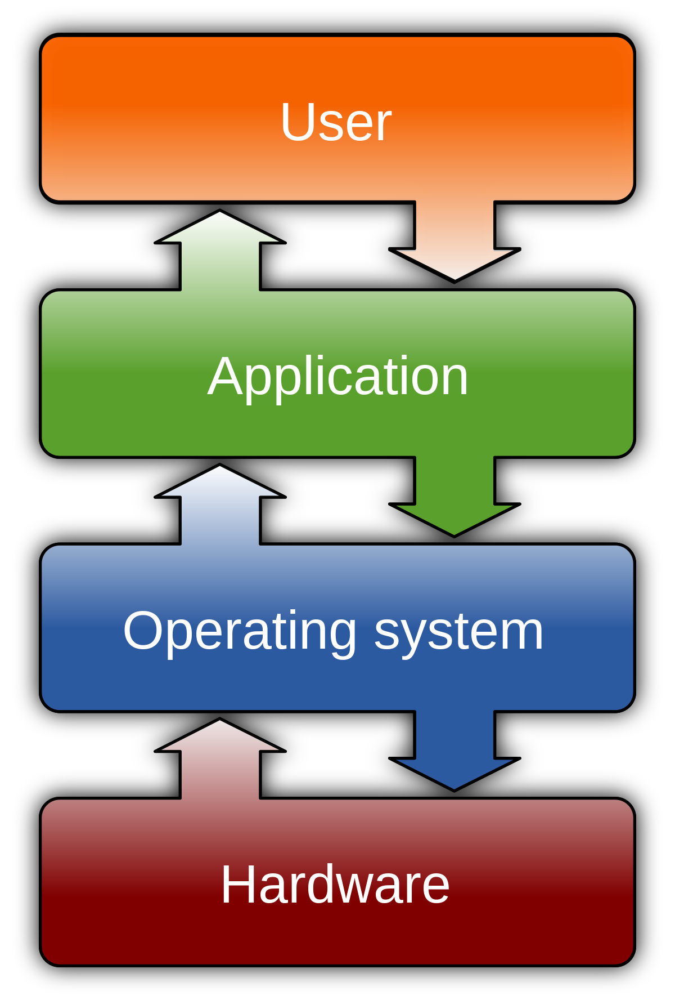

# OS
## 1. OS란?
### 운영체제란?
- 운영체제는 컴퓨터 시스템의 자원들을 효율적으로 관리하며, 사용자가 컴퓨터를 편리하고, 효과적으로 사용할 수 있도록 환경을 제공하는 여러 프로그램의 모입이다.
- 운영체제는 컴퓨터 사용자와 컴퓨터 하드웨어 간의 인터페이스로 동작하는 시스템 소프트웨어의 일종으로, 다른 응용프로그램이 유용한 작업을 할 수 있도록 환경을 제공해 준다.
- 

### 운영체제의 5가지 구성요소
- 
- OS는 Kernel과 Utility-Program으로 나눈다.
#### Kernel
- 운영체제의 핵심
- 컴퓨터가 처음 부팅될 때, 주기억 장치에 적재되어 시스템 종료전까지 계속 주 기억장치에 적재되는 프로그램.
- 빈번하게 실행되는 프로그램을 디스크에 둘 경우 주 기억장치와 디스크간의 입출력이 너무 빈번하게 일어나기 때문에 성능 저하가 발생한다.
- 즉, 필수적으로 자주 쓰이는 프로그램을 메모리에 상주시키는 프로그램을 Kernel이라 한다.
- Kernel보다 더 빠른 실행이 필요하고 높은 수준의 보호가 필요한 것은 마이크로 프로그래밍을 진행하여 ROM or PLA같은 칩으로 만들기도 하는데 이를 펌웨어라고 한다.
- 펌웨어: 외적으로는 하드웨어, 내적으로는 프로그램

#### Utility-Program
- 어떤 문제를 해결하기 위해서 사용자 또는 특정 업무에 대한 전문가들에 의해서 작성된 프로그램이다.

### OS의 목적
- 사용자의 편리성과 자원을 효율적으로 사용하기 위함이다.

