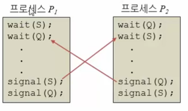

# OS
## 1. OS란?
### 운영체제란?
- 운영체제는 컴퓨터 시스템의 자원들을 효율적으로 관리하며, 사용자가 컴퓨터를 편리하고, 효과적으로 사용할 수 있도록 환경을 제공하는 여러 프로그램의 모입이다.
- 운영체제는 컴퓨터 사용자와 컴퓨터 하드웨어 간의 인터페이스로 동작하는 시스템 소프트웨어의 일종으로, 다른 응용프로그램이 유용한 작업을 할 수 있도록 환경을 제공해 준다.
- 

### 운영체제의 5가지 구성요소
- 
- OS는 Kernel과 Utility-Program으로 나눈다.
#### Kernel
- 운영체제의 핵심
- 컴퓨터가 처음 부팅될 때, 주기억 장치에 적재되어 시스템 종료전까지 계속 주 기억장치에 적재되는 프로그램.
- 빈번하게 실행되는 프로그램을 디스크에 둘 경우 주 기억장치와 디스크간의 입출력이 너무 빈번하게 일어나기 때문에 성능 저하가 발생한다.
- 즉, 필수적으로 자주 쓰이는 프로그램을 메모리에 상주시키는 프로그램을 Kernel이라 한다.
- Kernel보다 더 빠른 실행이 필요하고 높은 수준의 보호가 필요한 것은 마이크로 프로그래밍을 진행하여 ROM or PLA같은 칩으로 만들기도 하는데 이를 펌웨어라고 한다.
- 펌웨어: 외적으로는 하드웨어, 내적으로는 프로그램

#### Utility-Program
- 어떤 문제를 해결하기 위해서 사용자 또는 특정 업무에 대한 전문가들에 의해서 작성된 프로그램이다.

### OS의 목적
- 사용자의 편리성과 자원을 효율적으로 사용하기 위함이다.

## 2. Context Switching
### Q. 컨택스트 스위칭에 대하여 설명하세요.
- 컨택스트 스위칭은 하나의 task가 끝날 때까지 기다리지 않고, 동시에 여러 task를 번갈아가면서 실행하는 방법이다.
- 인터럽트가 발생하면 현재 프로세스의 상태를 PCB에 저장하고 새로운 프로세스의 상태를 레지스터에 저장한다. 이와 같은 과정은 cpu는 아무 일도 하지 않기 때문에 잦은 컨택스트 스위칭은 성능저하를 야기한다.
- 스레드와 프로세스의 동작방식이 약간 상이한데, 스레드는 캐시 메모리나 PCB에 저장해야하는 내용이 적고, 비워야 하는 내용도 적기 때문에 상대적으로 더 빠른 컨택스트 스위칭이 일어날 수 있다.

### Context
- OS에서 컨택스트는 CPU가 프로세스를 실행하기 위해서 필요한 프로세스에 관한 정보이다.

### PCB (Process Control Block)
- 프로세스(Process)가 생성되면 메모리에 해당 프로세스의 PCB가 함께 생성되고, 종료시 삭제된다.
- PCB는 관리 대상 프로세스에 대한 정보를 포함하는 운영체제 Kernel 내부에 존재하는 자료구조이다.
- CPU는 프로세스를 실행할 때, PCB에 있는 해당 프로세스의 컨택스트를 읽어서 레지스터 값을 변경한다.

### 컨택스트 스위칭
- 
- 멀티프로세스 환경에서 CPU가 어떤 하나의 프로세스를 실행하고 있는 상태에서 인터럽트 요청에 의해 다음 우선 순위의 프로세스가 실행되어야 할 때, 기존의 프로세스의 상태 또는 
레지스터 값을 저장하고, CPU가 다음 프로세스를 수행하도록 새로운 프로세스의 상태 또는 레지스터 값으로 교체하는 작업이다.
- CPU의 개수가 스레드의 개수보다 같거나 적으면 Context Switching이 발생하지 않는다.
- 프로세스 간의 Context Switching은 OS 스케쥴러가 담당한다.

### 인터럽트
- CPU가 프로그램을 실행하고 있을 때, 입출력 하드웨어 등의 장치에 예외상황이 발생하여 처리가 필요한 경우 CPU에게 알려 처리할 수 있도록 하는 것이다.
- 인터럽트가 발생하면 프로세스가 하던 일을 멈추고 이미 정해진 코드에서 요청에 대한 처리를 수행한다.
- 컨텍스트 스위칭이 발생시키는 인터럽트 종류
  - I/O request: 입출력 (I/O) 요청이 왔을 경우
  - Time Slice Expired: CPU 사용시간이 만료되었을 경우
  - Fork a Child: 자식 프로세스를 만들 경우
  - Wait for an Interrupt: 인터럽트 처리를 기다릴 경우

### 프로세스, 스레드 컨텍스트 스위칭
#### 프로세스 컨텍스트 스위칭
- 각 프로세스는 공유하는 데이터가 없기 때문에 Cache가 지금껏 쌓은 데이터를 없애고 새로운 Cache 정보를 쌓아야 한다는 부담요소가 있다.
#### 스레드 컨텍스트 스위칭
- 서로 공유하는 영역 (Code, Data, Heap)에 대한 Cache 정보를 사용할 수 있기 때문에 프로세스 컨텍스트 스위칭보다 부담이 적다.

### OS 스케쥴러
- 컨택스트 스위칭을 하는 주체이다.
- 인터럽트가 발생했을 때, 다음 차례로 수행할 프로세스를 결정한다.
- 프로세스를 Time-Slicing을 통해 동시에 수행하는 것처럼 보이게 하지만 사실은 하나씩 처리한다.

## 3. 동기와 비동기
### Q. 동기와 비동기의 차이?
- 동기: 메소드를 실행시킴과 동시에 반환 값이 기대되는 경우
- 비동기: 메소드를 실행시킴과 동시에 반환되지 않는 경우
- 동시라는 말은 실행되었을 때, 값이 반환되기 전까지는 Blocking 되었다는 것을 의미한다.
- 비동기의 경우, Blocking되지 않고 이벤트 큐에 넣거나 백그라운드 스레드에게 해당 task를 위임하고, 바로 다음 코드를 실행하기 때문에 기대되는 값이 바로 반환되지 않는다.

### 동기와 비동기
- 동기 방식은 메소드 리턴과 결과를 전달받는 시간이 일치하는 명령 실행 방식으로 한 함수가 끝나는 시간과 바로 다음 함수가 시작하는 시간이 동일하다.
- A가 끝나는 시간과 B가 시작하는 시간이 동일하다.

- A와 B가 시작시간 또는 종로시간이 동일하다.

- 비동기 방식은 여러 개의 처리가 함께 실행되는 방식으로 동기 방식에 비해 단위시간 당 많은 작업을 처리할 수 있다.
- 작업을 수행하는 주체의 시작시간과 상관없이 각자의 시작시간과 끝나는 시간을 가지고 있다.

- CPU나 메모리를 많이 사용하는 작업을 비동기로 처리하면 과부하가 걸릴 수 있고 프로그램의 복잡도도 증가한다.

### Blocking / Non-Bloking
- 동기 비동기와 다름 관점으로 직접 제어할 수 없는 대상(IO/Multi-Thread)을 상대하는 방법에 대한 분류이다.
- Blocking은 대상의 작업이 끝날 때까지 제어권을 대상이 가지고 있는 것을 의미한다.
- Non-Blocking은 대상의 작업 완료여부와 상관없이 새로운 작업을 수행한다.

## 4. Thread-Safe
### Q. Thread-safe 하다는 의미와 설계하는 법을 설명하라.
- 두 개 이상의 스레드가 Race Condition에 들어가거나 같은 객체에 동시에 접근해도 연산 결과의 정확성이 보장될 수 있게 도와주는 메모리 가시성이 확보된 상태를 의미한다.
- Java에서 Thread-safe한 설계를 위해서는
  - java.util.concurrent 패키지 하위 클래스를 사용한다.
  - 인스턴스 변수를 두지 않는다.
  - Singleton 패턴을 사용한다.
    - Singleton패턴: 애플리케이션이 시작되고 하나의 클래스 인스턴스를 보장하고, 전역적인 접근점을 제공하는 패턴
    - 멀티 스레드 환경에서는 동기화 처리를 하지 않으면 여러개가 생성될 수 있다.
    - 일반적으로 구현하는 싱글톤패턴은 Thread-safe하지 않다.
  - Syncronized block에서 연산을 수행한다.

### Thread-safe
- 멀티 스레드 프로글래밍에서 어떤 함수나, 변수, 혹은 객체가 어떤 스레드로부터 동시에 접근이 이루어져도 문제가 생기지 않는다는 것을 의미한다.
- 여러 곳에서 동시에 접근하더라도 결과값이 올바르다는 것

### Thread-safe 구현방법
- 재진입성 (Re-entrancy)\
어떤 함수가 한 스레드에 의해 호출되어 실행 중일 때, 다른 스레드가 그 함수를 호출하더라도 그 결과가 각각에게 올바르게 주어져야 한다.
- 상호 배제 (Mutual Exclusion)\
공유 자원을 사용할 경우, 해당 자원에 대한 접근을 LOCK으로 통제한다.
- 스레드 지역 저장소 (Thread-Local Storage)\
공유 자원의 사용을 최대한 줄여 각각의 스레드에서만 접근 가능한 저장소를 사용함으로써 동시에 접근을 막는다.
- 원자 연산 (Atomic Operation)\
공유 자원에 접근할 때, 원자 연산 또는 원자적으로 정의된 접근 방법을 사용하여 상호 배제를 구현할 수 있다.\
Atomic: 프로그래밍에서 데이터의 변경이 동시에 일어난 것처럼 보이게 하는 것을 의미한다.\
데이터의 값을 변경하는 것은 항상 변경에 대한 시간이 필요하다. Atomic한 데이터에 변경이 이루어지는 시간에 LOCK을 걸어 다른 접근을 막는다.
- 불변 객체 (Immutable Object)\
객체 생성 이후에 값을 변경할 수 없도록 만든다.

## 5. 프로세스 동기화
### Q. 프로세스 동기화에 대해 설명하기
- 다중 프로세스 환경에서 자원 등에 한 프로세스만이 접근가능하도록 하는 것이다.
- 프로세스 동기화를 하지 않으면 데이터의 일관성이 깨지기 때문에 연산결과가 잘못 반환될 가능성이 존재하기 때문에 주의해야 한다.
- 경쟁 상태(Race Condition): 여러 프로세스나 스레드가 동기화 메커니즘 없이 자원에 접근하려는 상황을 가리킨다. 공유된 자원에 대한 접근 순서에 따라 실행 결과가 
달라질 수 있는 상황을 의미한다.
  - 프로세스 동기화가 필요하다.
  - 공유 데이터 조작을 원자적 연산(Atomic Operation)으로 처리하면 경쟁 조건은 발생하지 않는다.
- 임계 구역(Critical Section): 여러 스레드가 동시에 접근해서는 안되는 공유자원에 접근하는 코드 블럭을 얘기한다. 한 임계구역에 하나의 스레드 혹은 프로세스만 접근이 가능하다.
 임계 구역에 접근하는 것을 제어하기 위해 세마포어, 뮤텍스와 같은 매커니즘을 사용한다.

- 임계 구역 문제를 해결하기 위한 조건
  - 상호 배제(Mutual Exclusion): 한 프로세스가 임계구역에서 동작중이면 다른 프로세스는 접근할 수 없다.
  - 진행(Progress): 임계구역에서 작업중인 프로세스가 없으면 임계구역으로 진입하려는 프로세스를 적절히 선택하여 진입할 수 있다.
  - 유한 대기(Bounded Waiting): 한 프로세스가 임계영역으로 진입을 요청한 후 다른 프로세스는 진입이 유한한 횟수로 제한되어야 한다.
  - 세가지 조건을 만족하는 코드를 Entry Section과 Exit Section에 삽입해야만 동기화 문제를 해결할 수 있다.

### 프로세스 동기화
- 협력하는 프로세스들 사이의 실행 순서 규칙을 보장한다.
- 공유되는 데이터의 일관성(Consistency)을 보장한다.

- fork를 통해서 자식 프로세스를 생성했을 때, 자식 프로세스의 exit(0) 함수가 실행하는 시점과 부모 프로세스의 wait(NULL) 함수가 리턴되는 시점이 맞춰진다.
  - exit 실행 -> wait 실행 순서를 일치시켜준다. (= 두 프로세스의 동기화를 이룬다.)
- 데이터 통신 과정에서 프로세스 A의 send와 프로세스 B의 recieve가 각각 코드에서 실행되는 시점을 일치시키키 위해 어느 한쪽에서 대기해야한다.
  - 프로세스들 사이의 실행 순서를 맞춘다.
- 여러 프로세스가 독자적으로 공유 변수 counter의 값을 변경하게 되면 해당 공유 변수는 원하는 값을 갖지 않게된다.

## 6. 동기화의 기본적인 해결방법
1. 임계 영역 으로의 집입 가능성을 확인하고 진입을 원자적으로 처리한다.
2. 경쟁 조건이 발생하지 않도록 해야하고 진입하게 되면 임계 영역으로 잠궈야 한다.(LOCK)

### 동기화를 위한 하드웨어적 해결방법
#### LOCK
- 하드웨어 기반 해결책으로써, 동시에 공유 자원에 접근하는 것을 막기 위해 Critical Section에 진입하는 프로세스는 LOCK을 획득하고 Critical 
Section을 빠져나올 때, LOCK을 방출함으로써 동시에 접근이 되지 않도록 한다.
- LOCK을 위한 공유변수를 변경하는 과정에서 CPU 인터럽트가 발생하면 LOCK을 통해서 동기화 문제를 해결할 수 없다.
- 그렇기 때문에 운영체제는 진입 가능성 확인 기능과 진입 기능을 쪼갤 수 없는 원자적 방식으로 LOCK을 위한 공유 변수를 제공한다.
#### LOCK의 한계
- 다중처리기 환경에서는 시간적인 효율성 측면에서 적용시킬 수 없다.

### 동기화를 위한 소프트웨어적 해결방법
#### Semaphore(세마포어)
- 운영체제는 소프트웨어상에서 Critical Section 문제를 해결하기 위한 동기화 도구로써 세마포어를 제공한다.
- 여러개의 프로세스가 접근 가능한 공유자원을 관리하는 방식으로, 다른 프로세스가 세마포어를 해제할 수 있다.

#### Semaphore의 구성
- Semaphore 변수 s
- 검사 연산 wait(s): lock획득
- 증가 연산 signal: lock해제
- 두 개의 프로세스가 같은 Semaphore 변수를 공유할 때, wait(s) 함수로 s 변수값을 통해 lock이 걸려 있는지를 확인하고 signal(s)함수를 통하여 s의 변수를 변경하여 lock을 해제한다.

#### Semaphore을 이용한 상호 배제 조건
- wait(mutex): lock이 걸려 있는지 확인한다. lock이 걸려있지 않다면(mutext>0) mutex --;을 통해 lock을 걸어준다.
- signal(mutex); 함수로 mutex++;을 통하여 lock을 풀어준다.

#### Semaphore의 한계
- Busy waiting (초기 버전)
  - Critical Section에 진입해야하는 프로세스는 진입 코드를 계속 반복해야 하며, CPU시간을 낭비한다.
- 일반적으로 Semaphore에서 Critical Section에 진입을 시도했지만 실패한 프로세스에 대해 Block을 시킨뒤, 
Critical Section에 자리가 날 때, 다시 깨우는 방식을 사용하여 Busy waiting으로 인한 시간낭비를 해결할 수 있다.

### Semaphore(세마포어)와 Mutex(뮤텍스)의 차이점?
- 세마포어는 여러개의 프로세스가 접근 가능한 공유자원을 관리하는 방식이고, 뮤텍스가 될 수 있지만, 뮤텍스는 한 번에 한 개의 프로세스만 
접근 가능하도록 관리하는 방식이다. 따라서 뮤텍스는 세마포어가 될 수 없다.
- 세마포어는 다른 프로세스가 세마포어를 해제할 수 있지만, 뮤텍스는 락을 획득한 프로세스만 락을 반환할 수 있다.

## 7. 동기화로 발생하는 문제점
- 동기화는 서로 병행적으로 실행되는 프로세스들의 실행 시점을 인위적으로 일치시킬 때, LOCK을 활용하여 한 쪽 프로세스의 실행을 막는다.
- 동기화 기법을 적용시킬 때, 문제가 발생할 수 있다.

### Deadlock(교착상태)
- 두 개 이상의 프로세스가 어떤 사건을 기다리고 있는데, 같이 기다리는 프로세스 중 하나만이 그 사건을 발생시킬 수 있는 상황이다.

- 그림과 같은 상황에서 P1은 S -> Q, P2는 Q -> S를 순서로 체크하여 LOCK을 획득하려 한다. 프로세스 P1의 입장에서 Q 변수에 대해 LOCK을 걸고 싶지만 이미 프로세스 
P2가 건 상태이므로 대기해야 한다. Q 변수에 대한 LOCK이 풀리기 위해서는 P2 signal(Q)을 실행해야 한다. 하지만 LOCK으로 인하여 signal(Q)을 실행시킬 수 없다.
 이러한 상황을 P1, P2가 교착상태에 빠져있다고 한다.

#### 발생조건
- 상호 배제: 한 번에 한 프로세스만 해당 자원을 사용할 수 있어야 한다.
- 점유 대기: 할당된 자원을 가진 상태에서 다른 자원을 기다린다.
- 비선점: 다른 프로세스가 자원의 사용을 끝낼 때까지 자원을 뺏을 수 없다.
- 순환대기: 각 프로세스가 순환적으로 다음 프로세스가 요구하는 자원을 가지고 있다.

#### 해결방법
- 예방: 4가지 조건 중 하나라도 만족되지 않도록 해야한다.
- 회피: 알고리즘을 데드락이 발생하지 않도록 해야한다.
- 회복: 교착상태가 발생할 때, 이를 해결 한다.
- 무시: 회복과정의 성능저하가 심하다면 무시한다.

### Starvation(기아)
- Infinite Blocking (무한 대기)라 한다.
- 프로세스가 Semaphore Queue에서 무한히 대기하는 상황이다.
- 상호 배제 조건만 만족시킨 경우 발생할 수 있는 문제이다.
#### 해결방법
- 우선순위를 변경한다.
- 우선순위를 수시로 변경하거나, 오래 기다린 프로세스의 우선순위를 높여주거나, Queue를 사용한다.
