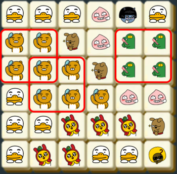
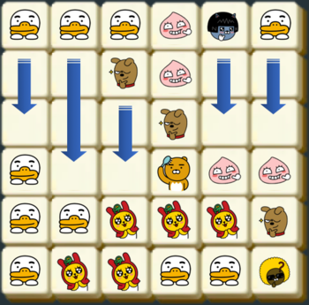

# 20221016 프로그래머스

## [1차]프렌즈4블록 (Level 2)
> https://school.programmers.co.kr/learn/courses/30/lessons/17679

### 문제
#### 문제 설명
블라인드 공채를 통과한 신입 사원 라이언은 신규 게임 개발 업무를 맡게 되었다. 이번에 출시할 게임 제목은 "프렌즈4블록".

같은 모양의 카카오프렌즈 블록이 2×2 형태로 4개가 붙어있을 경우 사라지면서 점수를 얻는 게임이다.



만약 판이 위와 같이 주어질 경우, 라이언이 2×2로 배치된 7개 블록과 콘이 2×2로 배치된 4개 블록이 지워진다. 같은 블록은 여러 2×2에 포함될 수 있으며, 지워지는 조건에 만족하는 2×2 모양이 여러 개 있다면 한꺼번에 지워진다.



블록이 지워진 후에 위에 있는 블록이 아래로 떨어져 빈 공간을 채우게 된다.

만약 빈 공간을 채운 후에 다시 2×2 형태로 같은 모양의 블록이 모이면 다시 지워지고 떨어지고를 반복하게 된다


위 초기 배치를 문자로 표시하면 아래와 같다.
```
TTTANT
RRFACC
RRRFCC
TRRRAA
TTMMMF
TMMTTJ
```

각 문자는 라이언(R), 무지(M), 어피치(A), 프로도(F), 네오(N), 튜브(T), 제이지(J), 콘(C)을 의미한다
입력으로 블록의 첫 배치가 주어졌을 때, 지워지는 블록은 모두 몇 개인지 판단하는 프로그램을 제작하라.

#### 입력 형식
- 입력으로 판의 높이 m, 폭 n과 판의 배치 정보 board가 들어온다.
- 2 ≦ n, m ≦ 30
- board는 길이 n인 문자열 m개의 배열로 주어진다. 블록을 나타내는 문자는 대문자 A에서 Z가 사용된다.

#### 출력 형식
입력으로 주어진 판 정보를 가지고 몇 개의 블록이 지워질지 출력하라.

### 구현
- 보드를 구성하고 완전탐색을 이용하여 2x2블록이 모두 동일한지 안한지를 완전 탐색후 리스트에 저장
- 저장한 리스트를 set함수를 활용하여 중복제거
- 중복제거한 set의 길이만큼 정답에 추가

### 나의 답변
```python
def solution(m, n, board):
    # board를 알아보기 편한 리스트로 변환
    board = list(list(i) for i in board)
    answer = 0
    while True:
        temp = list()
        for i in range(m-1):
            for j in range(n-1):
                # "0"이라면 블록이 비어있기 때문에 다음 블록으로 넘어간다.
                if board[i][j] == "0":
                    continue
                # 만약 4개의 블록이 동일하면 temp에 tuple형태로 값을 저장한다 (tuple로 저장한 이유는 추후 set처리를 해주기 위함)
                if board[i][j] == board[i][j+1] and board[i][j] == board[i+1][j] and board[i][j] == board[i+1][j+1]:
                    temp.append((i, j))
                    temp.append((i, j+1))
                    temp.append((i+1, j))
                    temp.append((i+1, j+1))

        # 만약 temp에 아무것도 없다면 더이상 터트릴 블록이 없기때문에 종료한다.
        if len(temp) == 0:
            break

        # 한 라운드에 터진 블록의 갯수를 len(set(temp))로 처리를 해주었다.
        answer += len(set(temp))
        for i in temp:
            board[i[0]][i[1]] = "0"

        # 아래에서부터 y축으로만 그 밑에 "0"이 들어오면 이전에 있던 위치에 "0"을 넣어주고 넣어야 될 부분에 이전 블록을 이동시켜준다. 이를 반복한다.
        for i in reversed(temp):
            column = i[1]
            afterRow = i[0]
            beforeRow = i[0] - 1
            while beforeRow >= 0:
                if board[afterRow][column] == "0" and board[beforeRow][column] != "0":
                    board[afterRow][column] = board[beforeRow][column]
                    board[beforeRow][column] = "0"
                    afterRow -= 1
                beforeRow -= 1
    return answer
```

### 코드리뷰 답변
```python
```