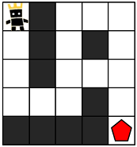

# 20221022 프로그래머스

## 게임 맵 최단거리 (Level 2)
> https://school.programmers.co.kr/learn/courses/30/lessons/1844

### 문제
#### 문제 설명
ROR 게임은 두 팀으로 나누어서 진행하며, 상대 팀 진영을 먼저 파괴하면 이기는 게임입니다. 따라서, 각 팀은 상대 팀 진영에 최대한 빨리 도착하는 것이 유리합니다.

지금부터 당신은 한 팀의 팀원이 되어 게임을 진행하려고 합니다. 다음은 5 x 5 크기의 맵에, 당신의 캐릭터가 (행: 1, 열: 1) 위치에 있고, 상대 팀 진영은 (행: 5, 열: 5) 위치에 있는 경우의 예시입니다.



위 그림에서 검은색 부분은 벽으로 막혀있어 갈 수 없는 길이며, 흰색 부분은 갈 수 있는 길입니다. 캐릭터가 움직일 때는 동, 서, 남, 북 방향으로 한 칸씩 이동하며, 게임 맵을 벗어난 길은 갈 수 없습니다.
아래 예시는 캐릭터가 상대 팀 진영으로 가는 두 가지 방법을 나타내고 있습니다.

- 첫 번째 방법은 11개의 칸을 지나서 상대 팀 진영에 도착했습니다.


- 두 번째 방법은 15개의 칸을 지나서 상대팀 진영에 도착했습니다.


위 예시에서는 첫 번째 방법보다 더 빠르게 상대팀 진영에 도착하는 방법은 없으므로, 이 방법이 상대 팀 진영으로 가는 가장 빠른 방법입니다.

만약, 상대 팀이 자신의 팀 진영 주위에 벽을 세워두었다면 상대 팀 진영에 도착하지 못할 수도 있습니다. 예를 들어, 다음과 같은 경우에 당신의 캐릭터는 상대 팀 진영에 도착할 수 없습니다.


게임 맵의 상태 maps가 매개변수로 주어질 때, 캐릭터가 상대 팀 진영에 도착하기 위해서 지나가야 하는 칸의 개수의 최솟값을 return 하도록 solution 함수를 완성해주세요. 단, 상대 팀 진영에 도착할 수 없을 때는 -1을 return 해주세요.

#### 제한 사항
- maps는 n x m 크기의 게임 맵의 상태가 들어있는 2차원 배열로, n과 m은 각각 1 이상 100 이하의 자연수입니다.
  - n과 m은 서로 같을 수도, 다를 수도 있지만, n과 m이 모두 1인 경우는 입력으로 주어지지 않습니다.
- maps는 0과 1로만 이루어져 있으며, 0은 벽이 있는 자리, 1은 벽이 없는 자리를 나타냅니다.
- 처음에 캐릭터는 게임 맵의 좌측 상단인 (1, 1) 위치에 있으며, 상대방 진영은 게임 맵의 우측 하단인 (n, m) 위치에 있습니다.

### 구현
- BFS

### 나의 답변
```python
from collections import deque


def BFS(maps, x, y, visited):
    n, m = len(maps), len(maps[0])
    # queue지정 후 처음 위치 (0, 0) 초기화
    q = deque()
    q.append((x, y))
    
    # 상, 하, 좌, 우
    d = [(-1, 0), (1, 0), (0, -1), (0, 1)]
    # dictionary를 이용한 거리 계산
    distance = {(x, y): 0}
    # queue가 빌때까지 아래 로직을 돌린다. 만약 n x m위치로 가지 못한다면 -1 return
    while q:
        # queue성질: FIFO
        x, y = q.popleft()
        # 상하좌우를 모두 체크! 만약 보드내에서 아직 이동을 안하고 맵이 1이라면 q에 넣어주고 거리 + 1해줌, 그리고 visited 보드에 False -> True로 변경하는 알고리즘 
        for i in range(len(d)):
            dx = x + d[i][0]
            dy = y + d[i][1]
            if 0 <= dx < n and 0 <= dy < m and visited[dx][dy] is False and maps[dx][dy] == 1:
                if dx == n-1 and dy == m-1:
                    return distance[(x, y)] + 2
                q.append((dx, dy))
                distance[(dx, dy)] = distance[(x, y)] + 1
                visited[dx][dy] = True
    return -1


def solution(maps):
    # 지나간 길인지 체크하기 위한 visited board를 만들어 준다.
    visited = list([False] * len(maps[0]) for _ in range(len(maps)))
    # 초기 지점 (0, 0)에서 시작하여 (n, m)까지 가는 과정을 너비우선 탐색을 이용하여 찾는다.
    answer = BFS(maps, 0, 0, visited)
    return answer


print(solution([[1,0,1,1,1],[1,0,1,0,1],[1,0,1,1,1],[1,1,1,0,1],[0,0,0,0,1]]))

print(solution([[1,0,1,1,1],[1,0,1,0,1],[1,0,1,1,1],[1,1,1,0,0],[0,0,0,0,1]]))
```

### 코드리뷰 답변
```
```