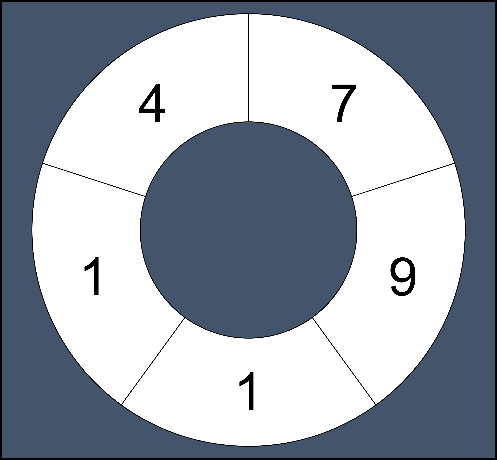

# 20221021 프로그래머스

## 연속 부분 수열 합의 개수 (Level 2)
> https://school.programmers.co.kr/learn/courses/30/lessons/131701

### 문제
#### 문제 설명
철호는 수열을 가지고 놀기 좋아합니다. 어느 날 철호는 어떤 자연수로 이루어진 원형 수열의 연속하는 부분 수열의 합으로 만들 수 있는 수가 모두 몇 가지인지 알아보고 싶어졌습니다. 원형 수열이란 일반적인 수열에서 처음과 끝이 연결된 형태의 수열을 말합니다. 예를 들어 수열 [7, 9, 1, 1, 4] 로 원형 수열을 만들면 다음과 같습니다.



원형 수열은 처음과 끝이 연결되어 끊기는 부분이 없기 때문에 연속하는 부분 수열도 일반적인 수열보다 많아집니다.

원형 수열의 모든 원소 elements가 순서대로 주어질 때, 원형 수열의 연속 부분 수열 합으로 만들 수 있는 수의 개수를 return 하도록 solution 함수를 완성해주세요.

#### 제한 사항
- 3 ≤ elements의 길이 ≤ 1,000
- 1 ≤ elements의 원소 ≤ 1,000

### 구현
- 완전탐색
- set

### 나의 답변
```python
def solution(elements):
    length = len(elements)
    elements += elements
    answer = set()
    for i in range(1, length+1):
        for j in range(length):
            s = sum(elements[j:j+i])
            answer.add(s)
    return len(answer)


print(solution([7,9,1,1,4]))
```

### 코드리뷰 답변
```python
```