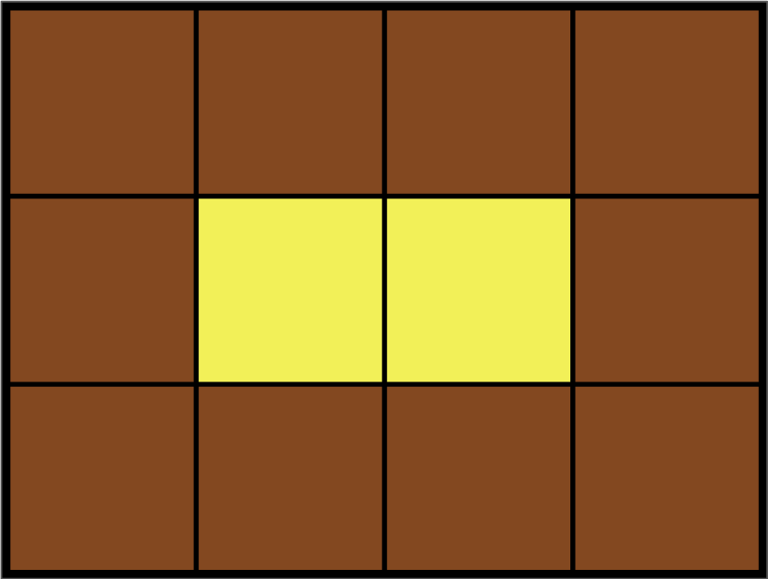

# 20221007 프로그래머스

## 카펫 (Level 2)
> https://school.programmers.co.kr/learn/courses/30/lessons/42842

### 문제
#### 문제 설명
Leo는 카펫을 사러 갔다가 아래 그림과 같이 중앙에는 노란색으로 칠해져 있고 테두리 1줄은 갈색으로 칠해져 있는 격자 모양 카펫을 봤습니다.



Leo는 집으로 돌아와서 아까 본 카펫의 노란색과 갈색으로 색칠된 격자의 개수는 기억했지만, 전체 카펫의 크기는 기억하지 못했습니다.

Leo가 본 카펫에서 갈색 격자의 수 brown, 노란색 격자의 수 yellow가 매개변수로 주어질 때 카펫의 가로, 세로 크기를 순서대로 배열에 담아 return 하도록 solution 함수를 작성해주세요.

#### 제한 사항
- 갈색 격자의 수 brown은 8 이상 5,000 이하인 자연수입니다.
- 노란색 격자의 수 yellow는 1 이상 2,000,000 이하인 자연수입니다.
- 카펫의 가로 길이는 세로 길이와 같거나, 세로 길이보다 깁니다.

### 구현

### 나의 답변
```python
def solution(brown, yellow):
    S = brown + yellow
    # i == width라고 생각하시면 됩니다.
    # 역순으로 한 것은 width >= height이기 때문이다.
    for i in range(S-1, -1, -1):
        # 면적이 가로 길이에 나누어 떨어지지 않으면 사각형이 아니기에 패스
        if S % i != 0:
            continue

        # 면적을 가로에 나누면 높이
        height = S // i
        # yellow의 너비
        y = (i - 2) * (height - 2)
        # brown은 둘레
        b = S - y

        if yellow == y and brown == b:
            return [i, height]
```

### 코드리뷰 답변
```python
```