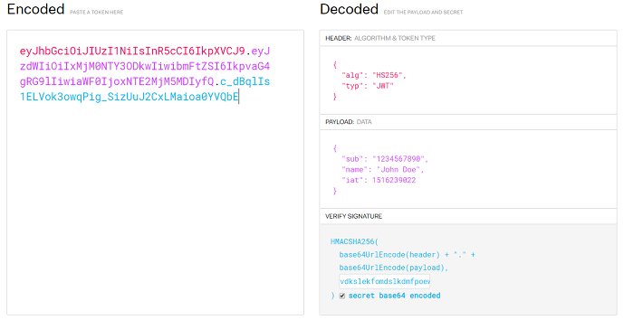

# JWT (JSON Web Token)

<details>
<summary>JWT 정의</summary>
<div markdown="1">

JWT(Json Web Token)란 Json 포맷을 이용하여 사용자에 대한 속성을 저장하는 Claim 기반의 Web Token이다. JWT는 토큰 자체를 정보로 사용하는 Self-Contained 방식으로 정보를 안전하게 전달한다. 주로 회원 인증이나 정보 전달에 사용되는 JWT는 아래의 로직을 따라서 처리된다.



- HEADER: Signature를 hashing하기 위한 알고리즘 정보가 담겨있다.
- PAYLOAD: 서버와 클라이언트가 주고 받는, 시스템에서 실제로 사용될 정보에 대한 내용들이 담겨있다.
- SIGNATURE: 토큰의 유효성 검증을 위한 문자열이다. 이 문자열을 통해 서버에서 이 토큰이 유효한지 검증할 수 있다.

### 장점
- 중앙의 인증서버, 데이터 스토어에 대한 의존성 없음, 시스템 수평 확장 유리
- Base64 URL SAFE Encoding 방식을 이용하여 URL, Cookie, Header 모두 사용 가능

### 단점
- Payload의 정보가 많아지면 네트워크 사용량 증가, 데이터 설계 고려 필요
- 토큰이 서버에 저장되지 않고, 클라이언트에 저장된다. > 서버에서 클라이언트의 토큰을 조작할 수 없다.
</div>
</details>

<details>
<summary>Security 설정</summary>
<div markdown="1">

### Security Configuration
- @EnagbleWebSecurity: 기본적인 웹 보안을 활성화 하겠다는 어노테이션

<details>
<summary>Security Configuration Code</summary>
<div markdown="2">

```java
import org.springframework.security.config.annotation.web.builders.HttpSecurity;
import org.springframework.security.config.annotation.web.configuration.EnableWebSecurity;

import org.springframework.context.annotation.Bean;
import org.springframework.security.config.annotation.method.configuration.EnableGlobalMethodSecurity;
import org.springframework.security.config.annotation.web.configuration.WebSecurityCustomizer;
import org.springframework.security.config.http.SessionCreationPolicy;
import org.springframework.security.crypto.bcrypt.BCryptPasswordEncoder;
import org.springframework.security.crypto.password.PasswordEncoder;
import org.springframework.security.web.SecurityFilterChain;
import org.springframework.security.web.authentication.UsernamePasswordAuthenticationFilter;

@EnableWebSecurity
@EnableGlobalMethodSecurity(prePostEnabled = true)
public class SecurityConfig {
    private final TokenProvider tokenProvider;
    private final CorsFilter corsFilter;
    private final JwtAuthenticationEntryPoint jwtAuthenticationEntryPoint;
    private final JwtAccessDeniedHandler jwtAccessDeniedHandler;

    public SecurityConfig(
            TokenProvider tokenProvider,
            CorsFilter corsFilter,
            JwtAuthenticationEntryPoint jwtAuthenticationEntryPoint,
            JwtAccessDeniedHandler jwtAccessDeniedHandler
    ) {
        this.tokenProvider = tokenProvider;
        this.corsFilter = corsFilter;
        this.jwtAuthenticationEntryPoint = jwtAuthenticationEntryPoint;
        this.jwtAccessDeniedHandler = jwtAccessDeniedHandler;
    }

    @Bean
    public PasswordEncoder passwordEncoder() {
        return new BCryptPasswordEncoder();
    }

    @Bean
    public WebSecurityCustomizer webSecurityCustomizer() {
        return (web) -> web.ignoring().antMatchers("/h2-console/**"
                , "/favicon.ico"
                , "/error");
    }

    @Bean
    public SecurityFilterChain filterChain(HttpSecurity httpSecurity) throws Exception {
        httpSecurity
                // token을 사용하는 방식이기 때문에 csrf를 disable합니다.
                .csrf().disable()

                .addFilterBefore(corsFilter, UsernamePasswordAuthenticationFilter.class)

                .exceptionHandling()
                .authenticationEntryPoint(jwtAuthenticationEntryPoint)
                .accessDeniedHandler(jwtAccessDeniedHandler)

                // enable h2-console
                .and()
                .headers()
                .frameOptions()
                .sameOrigin()

                // 세션을 사용하지 않기 때문에 STATELESS로 설정
                .and()
                .sessionManagement()
                .sessionCreationPolicy(SessionCreationPolicy.STATELESS)

                .and()
                .authorizeRequests()
                .antMatchers("/api/hello").permitAll()
                .antMatchers("/api/authenticate").permitAll()
                .antMatchers("/api/signup").permitAll()

                .anyRequest().authenticated()

                .and()
                .apply(new JwtSecurityConfig(tokenProvider));

        return httpSecurity.build();
    }
}
```
</div>
</details>

### 설정
- HS512 알고리즘을 사용하기때문에 Secret Key는 64Byte이 되어야 한다.

<details>
<summary>Application.yml설정</summary>
<div markdown="2">

```java
jwt:
    header: Authorization
    secret: {보안키}
    token-validity-in-seconds: {만료시간}
```
</div>
</details>

<details>
<summary>라이브러리 설정</summary>
<div markdown="2">

```java
implementation 'org.springframework.boot:spring-boot-starter-security'
implementation group: 'io.jsonwebtoken', name: 'jjwt-api', version: '0.11.5'
runtimeOnly group: 'io.jsonwebtoken', name: 'jjwt-impl', version: '0.11.5'
runtimeOnly group: 'io.jsonwebtoken', name: 'jjwt-jackson', version: '0.11.5'
```

</div>
</details>

</div>
</details>


<details>
<summary>Token Provider</summary>
<div markdown="1">

- 토큰의 생성, 토큰의 유효성 검증을 담당

<details>
<summary>token provider code</summary>
<div markdown="1">

- Initializing Bean을 Implements해서 afterPropertiesSet을 Override한 이유는 빈이 생성이 되고 의존성 주입을 받은 후에 secret값을 Base64 Decode해서 Key변수에 할당하여주기 위함이다.
- Authentication객체의 권한정보를 이용해서 토큰을 생성하는 createToken 메소드
- Token에 담겨있는 정보를 이용해서 Authentication 객체를 return하는 getAuthentication 메소드
- Token의 유효성 검증을 수행하는 validateToken 메소드 (토큰을 파싱해보고 발생하는 익셉션들을 캐치하여 문제가 있다면 false, 있다면 true)
```java
import io.jsonwebtoken.*;
import io.jsonwebtoken.io.Decoders;
import io.jsonwebtoken.security.Keys;
import org.slf4j.Logger;
import org.slf4j.LoggerFactory;
import org.springframework.beans.factory.InitializingBean;
import org.springframework.beans.factory.annotation.Value;
import org.springframework.security.authentication.UsernamePasswordAuthenticationToken;
import org.springframework.security.core.Authentication;
import org.springframework.security.core.GrantedAuthority;
import org.springframework.security.core.authority.SimpleGrantedAuthority;
import org.springframework.security.core.userdetails.User;
import org.springframework.stereotype.Component;

import java.security.Key;
import java.util.Arrays;
import java.util.Collection;
import java.util.Date;
import java.util.stream.Collectors;

@Component
public class TokenProvider implements InitializingBean {

    private final Logger logger = LoggerFactory.getLogger(TokenProvider.class);
    private static final String AUTHORITIES_KEY = "auth";
    private final String secret;
    private final long tokenValidityInMilliseconds;
    private Key key;

    public TokenProvider(
            @Value("${jwt.secret}") String secret,
            @Value("${jwt.token-validity-in-seconds}") long tokenValidityInSeconds) {
        this.secret = secret;
        this.tokenValidityInMilliseconds = tokenValidityInSeconds * 1000;
    }

    @Override
    public void afterPropertiesSet() {
        byte[] keyBytes = Decoders.BASE64.decode(secret);
        this.key = Keys.hmacShaKeyFor(keyBytes);
    }

    public String createToken(Authentication authentication) {
        String authorities = authentication.getAuthorities().stream()
                .map(GrantedAuthority::getAuthority)
                .collect(Collectors.joining(","));

        long now = (new Date()).getTime();
        Date validity = new Date(now + this.tokenValidityInMilliseconds);

        return Jwts.builder()
                .setSubject(authentication.getName())
                .claim(AUTHORITIES_KEY, authorities)
                .signWith(key, SignatureAlgorithm.HS512)
                .setExpiration(validity)
                .compact();
    }

    public Authentication getAuthentication(String token) {
        Claims claims = Jwts
                .parserBuilder()
                .setSigningKey(key)
                .build()
                .parseClaimsJws(token)
                .getBody();

        Collection<? extends GrantedAuthority> authorities =
                Arrays.stream(claims.get(AUTHORITIES_KEY).toString().split(","))
                        .map(SimpleGrantedAuthority::new)
                        .collect(Collectors.toList());

        User principal = new User(claims.getSubject(), "", authorities);

        return new UsernamePasswordAuthenticationToken(principal, token, authorities);
    }

    public boolean validateToken(String token) {
        try {
            Jwts.parserBuilder().setSigningKey(key).build().parseClaimsJws(token);
            return true;
        } catch (io.jsonwebtoken.security.SecurityException | MalformedJwtException e) {
            logger.info("잘못된 JWT 서명입니다.");
        } catch (ExpiredJwtException e) {
            logger.info("만료된 JWT 토큰입니다.");
        } catch (UnsupportedJwtException e) {
            logger.info("지원되지 않는 JWT 토큰입니다.");
        } catch (IllegalArgumentException e) {
            logger.info("JWT 토큰이 잘못되었습니다.");
        }
        return false;
    }
```

</div>
</details>

</div>
</details>

<details>
<summary>JWT Filter</summary>
<div markdown="1">

- JWT를 위한 커스텀 필터를 만들기 위함이다.

<details>
<summary>jwt filter code</summary>
<div markdown="2">

- 토큰 프로바이더를 주입받는다
- GenericFilterBean을 extends해서 doFilter를 Override한다.
- 실제 필터링 로직은 doFilter 내부에 작성한다.
- doFilter의 역할: 토큰의 인증정보를 SecurityContext에 저장하는 역할을 수행한다.
- Request Header에서 토큰 정보를 꺼내오기 위한 resolveToken 메소드

```java
import org.slf4j.Logger;
import org.slf4j.LoggerFactory;
import org.springframework.security.core.Authentication;
import org.springframework.security.core.context.SecurityContextHolder;
import org.springframework.util.StringUtils;
import org.springframework.web.filter.GenericFilterBean;

import javax.servlet.FilterChain;
import javax.servlet.ServletException;
import javax.servlet.ServletRequest;
import javax.servlet.ServletResponse;
import javax.servlet.http.HttpServletRequest;
import java.io.IOException;

public class JwtFilter extends GenericFilterBean {

    private static final Logger logger = LoggerFactory.getLogger(JwtFilter.class);
    public static final String AUTHORIZATION_HEADER = "Authorization";
    private TokenProvider tokenProvider;
    public JwtFilter(TokenProvider tokenProvider) {
        this.tokenProvider = tokenProvider;
    }

    @Override
    public void doFilter(ServletRequest servletRequest, ServletResponse servletResponse, FilterChain filterChain) throws IOException, ServletException {
        HttpServletRequest httpServletRequest = (HttpServletRequest) servletRequest;
        String jwt = resolveToken(httpServletRequest);
        String requestURI = httpServletRequest.getRequestURI();

        if (StringUtils.hasText(jwt) && tokenProvider.validateToken(jwt)) {
            Authentication authentication = tokenProvider.getAuthentication(jwt);
            SecurityContextHolder.getContext().setAuthentication(authentication);
            logger.debug("Security Context에 '{}' 인증 정보를 저장했습니다, uri: {}", authentication.getName(), requestURI);
        } else {
            logger.debug("유효한 JWT 토큰이 없습니다, uri: {}", requestURI);
        }

        filterChain.doFilter(servletRequest, servletResponse);
    }

    private String resolveToken(HttpServletRequest request) {
        String bearerToken = request.getHeader(AUTHORIZATION_HEADER);

        if (StringUtils.hasText(bearerToken) && bearerToken.startsWith("Bearer ")) {
            return bearerToken.substring(7);
        }

        return null;
    }
}
```
</div>
</details>

</div>
</details>

<details>
<summary>JWT Security Config</summary>
<div markdown="1">

- TokenProvider, JWTFilter를 SecurityConfig에 적용할때 사용할 JWTSecurityConfig

<details>
<summary>jwt security config code</summary>
<div markdown="2">

- SecurityConfigurerAdapter를 extends하고 TokenProvider를 주입받아서 JwtFilter를 통해서 Security로직에 필터를 등록한다.
```java
import org.springframework.security.config.annotation.SecurityConfigurerAdapter;
import org.springframework.security.config.annotation.web.builders.HttpSecurity;
import org.springframework.security.web.DefaultSecurityFilterChain;
import org.springframework.security.web.authentication.UsernamePasswordAuthenticationFilter;

public class JwtSecurityConfig extends SecurityConfigurerAdapter<DefaultSecurityFilterChain, HttpSecurity> {
    private TokenProvider tokenProvider;
    public JwtSecurityConfig(TokenProvider tokenProvider) {
        this.tokenProvider = tokenProvider;
    }

    @Override
    public void configure(HttpSecurity http) {
        http.addFilterBefore(
                new JwtFilter(tokenProvider),
                UsernamePasswordAuthenticationFilter.class
        );
    }
}
```
</div>
</details>


</div>
</details>

<details>
<summary>JWT Authentication Entry Point</summary>
<div markdown="1">

- 유효한 자격증명을 제공하지 않고 접근하려 할때 401 Unauthorized 에러를 리턴하기 위함이다.

<details>
<summary>jwt authentication entry point code</summary>
<div markdown="2">

```java
import org.springframework.security.core.AuthenticationException;
import org.springframework.security.web.AuthenticationEntryPoint;
import org.springframework.stereotype.Component;

import javax.servlet.http.HttpServletRequest;
import javax.servlet.http.HttpServletResponse;
import java.io.IOException;

@Component
public class JwtAuthenticationEntryPoint implements AuthenticationEntryPoint {
    @Override
    public void commence(HttpServletRequest request,
                         HttpServletResponse response,
                         AuthenticationException authException) throws IOException {
        // 유효한 자격증명을 제공하지 않고 접근하려 할때 401
        response.sendError(HttpServletResponse.SC_UNAUTHORIZED);
    }
}
```

</div>
</details>

</div>
</details>

<details>
<summary>JWT Access Denied Handler</summary>
<div markdown="1">

- 필요한 권한이 존재하지 않는 경우에 403 Forbidden 에러를 리턴하기 위함이다.

<details>
<summary>jwt access denied handler code</summary>
<div markdown="2">

```java
import org.springframework.security.access.AccessDeniedException;
import org.springframework.security.web.access.AccessDeniedHandler;
import org.springframework.stereotype.Component;

import javax.servlet.http.HttpServletRequest;
import javax.servlet.http.HttpServletResponse;
import java.io.IOException;

@Component
public class JwtAccessDeniedHandler implements AccessDeniedHandler {
    @Override
    public void handle(HttpServletRequest request, HttpServletResponse response, AccessDeniedException accessDeniedException) throws IOException {
        //필요한 권한이 없이 접근하려 할때 403
        response.sendError(HttpServletResponse.SC_FORBIDDEN);
    }
}
```
</div>
</details>

</div>
</details>

<details>
<summary>Security Config 적용</summary>
<div markdown="1">

- 위 5개의 클래스를 SecurityConfig에 추가
- EnableGlobalMethodSecurity 어노테이션은 @PreAuthorize어노테이션을 메소드단위로 추가하기위해서 적용
- SecurityConfig는 TokenProvider, JwtAuthenticationEntryPoint, JwtAccessDeniedHandler 주입
- PasswordEncoder는 BCryptPasswordEncoder를 사용
- 토큰을 사용하기 때문에 csrf설정은 disable해주고 Exception을 핸들링할때, AuthenticationEntryPoint와 AccessDeniedHandler를 추가해준다.
- h2-console을 위한 설정 추가하였다.
- 세션을 사용하지 않기때문에 세션 설정을 STATELESS로 설정한다.
- 토큰을 받기 위한 로그인 api, 회원가입 api는 토큰이 없는 상태에서 요청이 들어오기 때문에 모두 permitAll 설정을 해주었다.
- 마지막으로 JwtFilter를 addFilterBefore로 등록했던 JwtSecurityConfig클래스도 적용을 해준다.

<details>
<summary>security config code</summary>
<div markdown="2">

```java
import org.springframework.security.config.annotation.web.builders.HttpSecurity;
import org.springframework.security.config.annotation.web.configuration.EnableWebSecurity;

import org.springframework.context.annotation.Bean;
import org.springframework.security.config.annotation.method.configuration.EnableGlobalMethodSecurity;
import org.springframework.security.config.annotation.web.configuration.WebSecurityCustomizer;
import org.springframework.security.config.http.SessionCreationPolicy;
import org.springframework.security.crypto.bcrypt.BCryptPasswordEncoder;
import org.springframework.security.crypto.password.PasswordEncoder;
import org.springframework.security.web.SecurityFilterChain;
import org.springframework.security.web.authentication.UsernamePasswordAuthenticationFilter;

@EnableWebSecurity
@EnableGlobalMethodSecurity(prePostEnabled = true)
public class SecurityConfig {
    private final TokenProvider tokenProvider;
    private final CorsFilter corsFilter;
    private final JwtAuthenticationEntryPoint jwtAuthenticationEntryPoint;
    private final JwtAccessDeniedHandler jwtAccessDeniedHandler;

    public SecurityConfig(
            TokenProvider tokenProvider,
            CorsFilter corsFilter,
            JwtAuthenticationEntryPoint jwtAuthenticationEntryPoint,
            JwtAccessDeniedHandler jwtAccessDeniedHandler
    ) {
        this.tokenProvider = tokenProvider;
        this.corsFilter = corsFilter;
        this.jwtAuthenticationEntryPoint = jwtAuthenticationEntryPoint;
        this.jwtAccessDeniedHandler = jwtAccessDeniedHandler;
    }

    @Bean
    public PasswordEncoder passwordEncoder() {
        return new BCryptPasswordEncoder();
    }

    @Bean
    public WebSecurityCustomizer webSecurityCustomizer() {
        return (web) -> web.ignoring().antMatchers("/h2-console/**"
                , "/favicon.ico"
                , "/error");
    }

    @Bean
    public SecurityFilterChain filterChain(HttpSecurity httpSecurity) throws Exception {
        httpSecurity
                // token을 사용하는 방식이기 때문에 csrf를 disable합니다.
                .csrf().disable()

                .addFilterBefore(corsFilter, UsernamePasswordAuthenticationFilter.class)

                .exceptionHandling()
                .authenticationEntryPoint(jwtAuthenticationEntryPoint)
                .accessDeniedHandler(jwtAccessDeniedHandler)

                // enable h2-console
                .and()
                .headers()
                .frameOptions()
                .sameOrigin()

                // 세션을 사용하지 않기 때문에 STATELESS로 설정
                .and()
                .sessionManagement()
                .sessionCreationPolicy(SessionCreationPolicy.STATELESS)

                .and()
                .authorizeRequests()
                .antMatchers("/api/hello").permitAll()
                .antMatchers("/api/authenticate").permitAll()
                .antMatchers("/api/signup").permitAll()

                .anyRequest().authenticated()

                .and()
                .apply(new JwtSecurityConfig(tokenProvider));

        return httpSecurity.build();
    }
}
```
</div>
</details>

</div>
</details>
