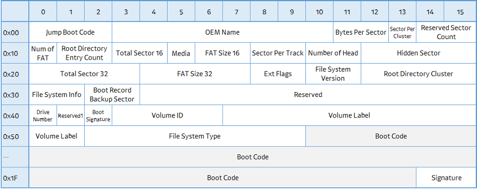
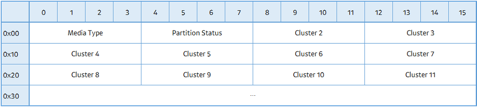
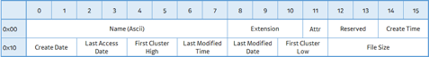
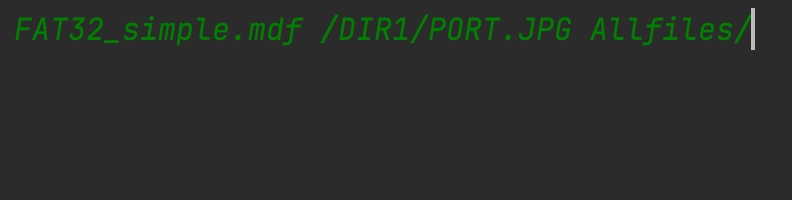
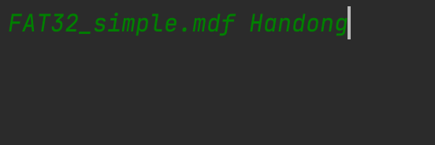

# FAT32
## 구조
- Boot Record
- FAT Area (Cluster Chain)
- Data Area (Directory Entry)
- Main 함수 및 동작확인

### Boot Record


- Boot Record 정보: 0x60 bytes
- Bytes Per Sector(11~12): 저장장치의 입출력 단위 섹터 Byte 크기 (일반적으로 0x200)
- Sector Per Cluster(13): FAT32의 입출력 단위인 클러스터 섹터 수
- Cluster Size: Bytes Per Sector(11 ~ 12) * Sector Per Cluster
- Reserved Sector Count(14): Reserved Area 섹터 수
  - 이를 통하여 FAT #1 Offset을 구할 수 있다.
  - FAT #1 Offset = Reserved Sector Count(14) * Bytes Per Sector(11~12)
- Num of FAT(16): FAT의 개수 (주로 0x02)
  - FAT Area의 크기 계산시 사용된다.
- num_of_sector_FAT_area(36~39) : 한 FAT 내의 섹터 수
  - Num of FAT와 조합하여 FAT Area 크기 계산
    - FAT Area Size = Num of FAT(16) * (num_of_sector_FAT_area(36~39) * Bytes Per Sector(11~12))
  - Data Area Offset = FAT #1 Offset(FAT영역의 시작 주소) + FAT Area Size

<details>
<summary>Boot Record, Endian Class</summary>
<div>

- Boot Record.py
```python
from endian import to_be, to_le


class Boot_Record:
    """
    Boot Record Class
    """

    def __init__(self, filename):
        count = 0
        byte_array = bytearray()
        with open(filename, 'rb') as f:
            while True:
                count += 1
                data = f.read(1)
                if data == b'':
                    break
                byte_array += data
                if count == 512:
                    break

        self.num_of_FAT_area = int(byte_array[16])
        self.num_of_byte_per_sector = int(to_le(byte_array[11:13]), 16)
        self.num_of_sector_per_cluster = int(byte_array[13])
        self.num_of_sector_reserved = int(to_le(byte_array[14:16]), 16)
        self.num_of_sector_FAT_area = int(to_le(byte_array[36:40]), 16)
        self.cluster_num_of_root_dir = int(to_le(byte_array[44:48]), 16)
        self.fat_region = self.num_of_sector_reserved * self.num_of_byte_per_sector
        self.data_region = self.fat_region + (self.num_of_FAT_area * self.num_of_sector_FAT_area * self.num_of_byte_per_sector)
        self.cluster_size = self.num_of_byte_per_sector * self.num_of_sector_per_cluster
        self.fat_size = self.num_of_sector_FAT_area * self.num_of_byte_per_sector
        self.fat_area_size = self.fat_size * self.num_of_FAT_area
        f.close()
```

- endian.py
```python
# 리틀앤디언
def to_le(bytes):
    result = ""
    for b in bytes[::-1]:
        temp = str(hex(b)[2:])
        if len(temp) == 1:
            temp = "0" + temp
        result += temp
    return result


# 빅앤디언
def to_be(bytes):
    result = ""
    for b in bytes:
        temp = str(hex(b)[2:])
        if len(temp) == 1:
            temp = "0" + temp
        result += temp
    return result

```
</div>
</details>

### FAT Area


- Data Area의 각 클러스터의 사용여부를 확인하기 위함
- 데이터가 여러 클러스터로 분할되어 저장되면 클러스터 체인으로 표현된다.
- FAT Entry 하나의 크기는 4Bytes
- 파일 바이트 데이터가 나눠진 상태로 분포하기 때문에 FAT Table을 이용하여 용이하게 사용하기 위함.

|Value|Description|
|---|---|
|0x0000000|할당되지 않은 클러스터|
|0x0000002 ~ 0xFFFFFEF|사용중인 클러스터이며, 클러스터 체인의 다음 클러스터 번호|
|0xFFFFFF0 ~ 0xFFFFFF6|Reserved 클러스터|
|0xFFFFFF7|사용할수없는 Bad Cluster|
|0xFFFFFF8 ~ 0xFFFFFFF| EOF|


<details>
<summary>Fat Class, Cluster Rule Class, Cluster Chain Class</summary>
<div>

- fat.py
```python
from endian import to_be, to_le


class fat_table:
    """
    fat table class
    """
    def __init__(self, filename, br):

        self.fat_table_list = list()

        offset = br.fat_region
        finish_count = br.num_of_sector_FAT_area // 4 + 1

        flag = 0
        while True:
            byte_array = bytearray()
            count = 0
            with open(filename, 'rb') as f:
                f.seek(offset)
                while True:
                    count += 1
                    data = f.read(1)
                    if data == b'':
                        break
                    byte_array += data
                    if count == 4:
                        break
            f.close()
            flag += 1
            offset += 4

            if flag == finish_count:
                break

            be_byte_array = to_be(byte_array)
            self.fat_table_list.append(be_byte_array)
```

- cluster_rule.py
```python
from cluster_chain import ClusterChain


class cluster_rule:
    def __init__(self, fatTable, first_cluster, dir_offset, cluster_num_of_root_dir, cluster_size):
        self.cluster_num = first_cluster
        self.cluster_list = list()
        cluster_chain = ClusterChain()
        while True:
            if self.cluster_num == len(fatTable):
                break
            if fatTable[self.cluster_num] in cluster_chain.eof:
                break
            if fatTable[self.cluster_num] == cluster_chain.bad_cluster:
                continue
            cluster_offset = dir_offset + (self.cluster_num - cluster_num_of_root_dir) * cluster_size
            if int('0x0000002', 0) <= self.cluster_num + 1 <= int('0xfffffef', 0):
                self.cluster_list.append((hex(cluster_offset), hex(cluster_size)))
            self.cluster_num += 1
```

- cluster_chain.py
```python
class ClusterChain:
    def __init__(self):
        self.free_cluster = '0x0000000'
        self.reserved_cluster = list(hex(i) for i in range(int('0xffffff0', 0), int('0xffffff6', 0) + 1))
        self.bad_cluster = '0xffffff7'
        self.eof = list(hex(i) for i in range(int('0xffffff8', 0), int('0xfffffff', 0) + 1))
```

</div>
</details>

### Data Area


- File의 실제 데이터 저장 위치
- Directory인 경우 내부 File의 메타 데이터를 저장하는 Directory Entry 저장
- Directory Entry Size: 32 bytes

- File name: 0 ~ 7
- Extension: 8 ~ 10
- Attribute: 11

|Value|Description|
|---|---|
|0x01|Read Only|
|0x02|Hidden|
|0x04|System|
|0x08|Volume Label|
|0x0F|LFN(Long File Name)|
|0x10|Directory|
|0x20|Archive|
|0x40|Device|
|0x80|Reserved|

  - First Cluster High: 20 ~ 21
  - First Cluster Low: 26 ~ 27
  - First_cluster: First Cluster Low + First Cluster High의 리틀엔디안
  - File Size: 28 ~ 31 (디렉토리의 경우 항상 0, 최대 크기는 4GB)

<details>
<summary>DirFileRead Class, DirPrepare Class, FileManage Class, Node Class</summary>
<div>

- DirFileRead Class
```python
from dir_prepare import dir_prepare
from cluster_rule import cluster_rule


class DirFileRead:
    def __init__(self, filename, br, dir_pre, fatTable, node_path, root_mgmt):
        for data in dir_pre.result_list:
            self.path = node_path
            if data.first_cluster >= len(fatTable.fat_table_list):
                continue

            if data.attribute == 16:
                self.path += str(data.name)[2:][:-1]
                if self.path[-1] == ".":
                    continue
                dir_pre = dir_prepare(filename, br, data.dir_offset)
                cluster_n = cluster_rule(fatTable.fat_table_list, data.first_cluster, br.data_region,
                                        br.cluster_num_of_root_dir, br.cluster_size)

                # hex (data.dir_offset), hex (data.file_size),
                root_mgmt.add([self.path, []])
                DirFileRead(filename, br, dir_pre, fatTable, self.path + "/", root_mgmt)

            elif data.attribute == 32:
                self.path += str(data.name)[2:][:-1] + "." + str(data.extension)[2:][:-1]
                cluster_n = cluster_rule(fatTable.fat_table_list, data.first_cluster, br.data_region,
                                        br.cluster_num_of_root_dir, br.cluster_size)
                root_mgmt.add([self.path, cluster_n.cluster_list])
```

- DirPrepare Class
```python
from endian import to_be, to_le
from file_manage import FileManage


class dir_prepare:
    """
    dir1_prepare class
    """
    def __init__(self, filename, br, dir_offset):
        self.result_list = list()

        offset = dir_offset
        while True:
            byte_array = bytearray()
            count = 0
            with open(filename, 'rb') as f:
                f.seek(offset)
                while True:
                    count += 1
                    data = f.read(1)
                    if data == b'':
                        break
                    byte_array += data
                    if count == 32:
                        break
            f.close()
            offset += 32

            if byte_array == bytearray(b'\x00\x00\x00\x00\x00\x00\x00\x00\x00\x00\x00\x00\x00\x00\x00\x00\x00\x00\x00\x00\x00\x00\x00\x00\x00\x00\x00\x00\x00\x00\x00\x00'):
                break

            name = byte_array[:8].decode('latin-1').encode("utf-8").strip()
            attribute = byte_array[11]
            first_cluster = int(to_le(byte_array[26:28] + byte_array[20:22]), 16)
            dir_offset = br.data_region + ((first_cluster - br.cluster_num_of_root_dir) * br.cluster_size)
            file_size = int(to_le(byte_array[28:]), 16)
            extension = byte_array[8:11].decode('latin-1').encode("utf-8").strip()
            file_manage = FileManage(name, attribute, first_cluster, dir_offset, file_size, extension)

            self.result_list.append(file_manage)

```

- FileManage Class
```python
class FileManage:
    def __init__(self, name, attribute, first_cluster, dir_offset, file_size, extension):
        self.name = name
        self.attribute = attribute
        self.first_cluster = first_cluster
        self.dir_offset = dir_offset
        self.file_size = file_size
        self.extension = extension

```

- Node Class (Node, Node Manage)
```python
import os


class Node:
    def __init__(self, data, next=None):
        self.data = data
        self.next = next


class NodeMgmt:
    def __init__(self, data):
        self.head = Node(data)
        self.path = ""

    def add(self, data):
        if self.head == "":
            self.head = Node(data)
        else:
            node = self.head
            while node.next:
                node = node.next
            node.next = Node(data)

    def all_files_export(self, filename, exportPath):
        node = self.head
        while node.next:
            path, data = node.data
            destination_dir = os.path.join(exportPath,  path[1:])
            if not os.path.exists(destination_dir) and not data:
                os.makedirs(destination_dir)
            elif data:
                byte_array = bytearray()
                for dir_offset, cluster_size in data:
                    count = 0
                    with open(filename, 'rb') as f:
                        f.seek(int(dir_offset, 16))
                        while True:
                            count += 1
                            data = f.read(1)
                            byte_array += data
                            if count == int(cluster_size, 16):
                                break
                    f.close()
                    with open(destination_dir, "wb") as f:
                        f.write(byte_array)
                    f.close()

            print(path, data)
            node = node.next

    def selected_file_export(self, filename, dataPath, exportPath):
        node = self.head
        while node.next:
            path, data = node.data
            destination_dir = os.path.join(exportPath,  path[1:])

            if not os.path.exists(destination_dir) and not data:
                os.makedirs(destination_dir)
            elif data and path == dataPath:
                byte_array = bytearray()
                for dir_offset, cluster_size in data:
                    count = 0
                    with open(filename, 'rb') as f:
                        f.seek(int(dir_offset, 16))
                        while True:
                            count += 1
                            data = f.read(1)
                            byte_array += data
                            if count == int(cluster_size, 16):
                                break
                    f.close()
                with open(destination_dir, "wb") as f:
                    f.write(byte_array)
                f.close()
                break

            print(path, data)
            node = node.next
```
FAT32_simple.mdf /DIR1/PORT.JPG Allfiles/
</div>
</details>

### Main 함수 및 동작 확인
- 메인화면 실행(특정 경로파일만 가져오기)
  - 입력

  - 출력

  
- 메인화면 실행(전체 파일 가져오기)
  - 입력

  - 출력


